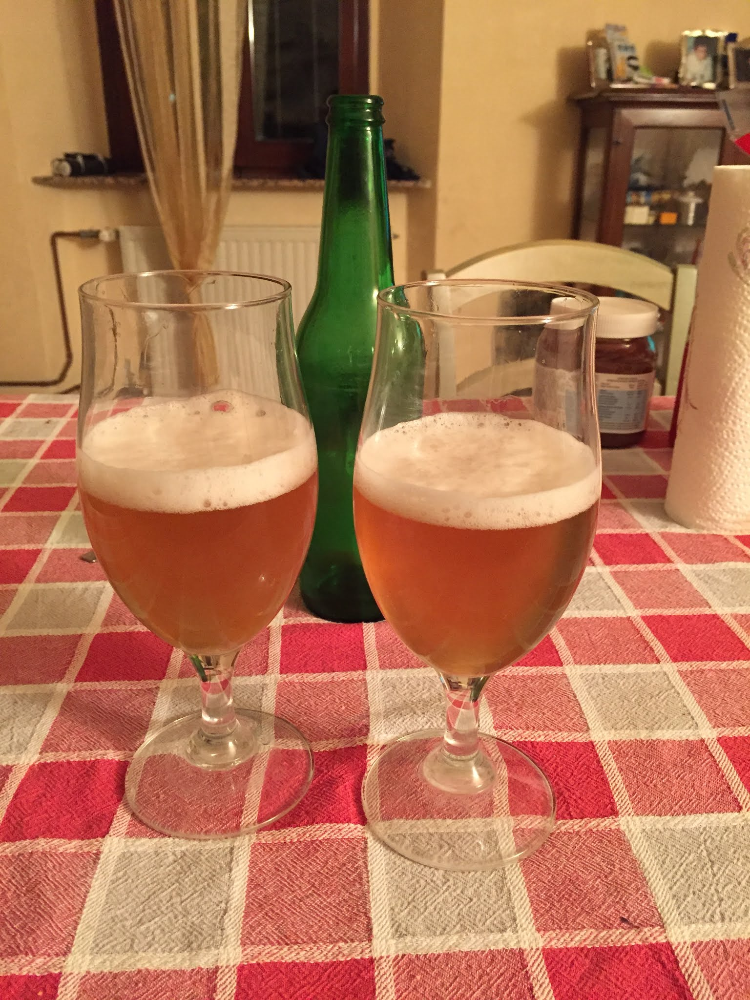
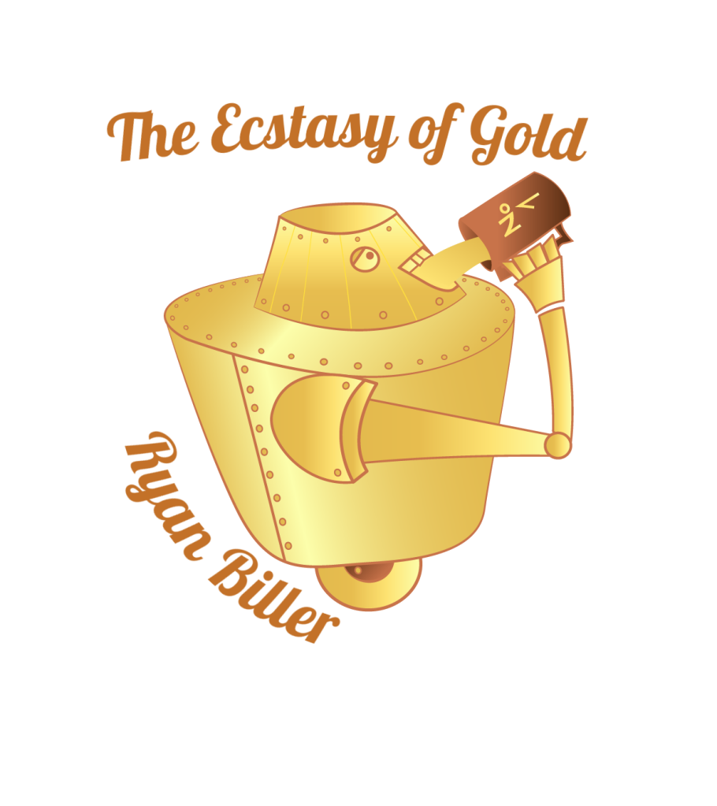

Nel 2016 ho cominciato a produrre birre insieme a due amici con il marchio Ryan Biller.

Dopo la prima birra da kit luppolato cominciammo subito con l'all grain con un impianto a tre tini alimentato a gas (descritto in un post dedicato: [[brew.hots.rb-set.3v.mk1]]).  
Le prime cotte ci vennero bene per gli standard dell'epoca e ci diedero slancio nella nostra produzione. Qualche problemino però cominciò a spuntare nella seconda metà dell'anno.

Tornando alla birra, questa fu una Mexican lager da kit luppolato Cooper prodotta il 6 marzo 2016.
Ci ha permesso di prendere confidenza con la fermentazione, per il resto birra poco riuscita di sapore sidroso, dimenticabile.

## Descrizione originale

A cura del maestro Miller.

> Birra artigianale di produzione casalinga, non pastorizzata, non filtrata, rifermentata in bottiglia.  
> Di basso tenore alcolico (3% vol.), all'olfatto spiccano note fresche agrumate.  
> Il sapore, leggero e non aggressivo dell'amaro, fa di questa birra una buona compagna per le giornate estive.

## Logo originale

