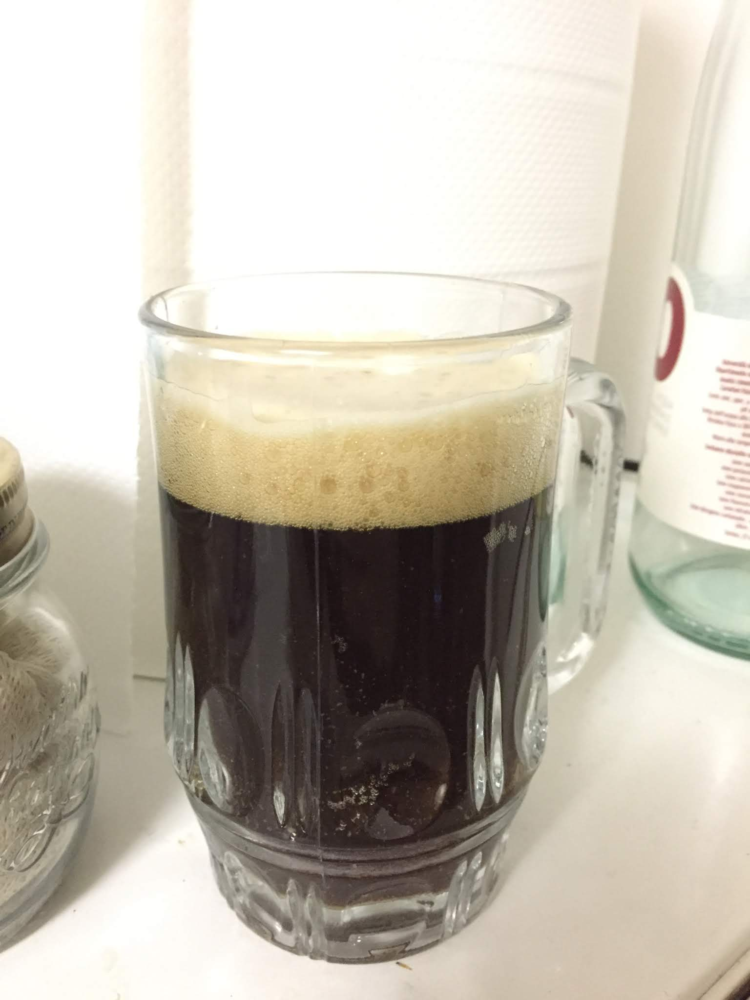

Porter brassata il 13 novembre 2016.

### Fermentabili

| Tipologia               | Percentuale |
|-------------------------|-------------|
| Malto Pale              | 86%         |
| Malto Crystal (200 Ebc) | 8%          |
| Malto Chocolate         | 6%          |

### Luppoli

| Varietà              | Tempo  | Amaro   |
|----------------------|--------|---------|
| Willamette           | 60 min | 20 IBU  |
| Willamette           | 20 min | 10 IBU  |
| Styrian Goldings     | 5 min  | 1 IBU   |

### Lievito

Fermentis Safale S-04

### Altro

Aggiunta di infuso a base di fave di cacao e Jack Daniel's (nel quale erano state precedentemente infuse le scaglie di quercia aggiunte alla Sons Of Mars)

Questa brown porter venne discretamente bene, senza particolari difetti se non forse un profilo fruttato dell'S-04 leggermente invadente (sicuramente aveva fermentato a più di 20 gradi). Un altro difetto riguardava l'estetica, senza winterizzazione avevamo portato in bottiglia qualche grumo di S-04 che girava libero nel fermentatore.

Fui soddisfatto della carbonazione, medio-bassa come vuole lo stile rispetto alle bombe che creavamo precedentemente con il misurino del kit (per la prima volta avevamo fatto priming in fermentatore prima di imbottigliare). Scarsa invece la schiuma.

