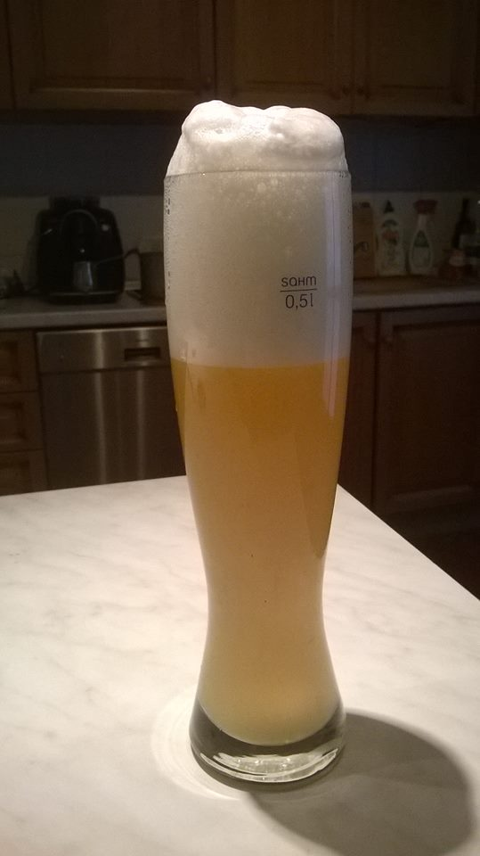

Continuamo con lo storico delle birre prodotte. Essendo il primo post di una ricetta ne approfitterò per introdurre un nuovo layout che cercherò di migliorare nei prossimi post di questo genere. Questa è stata la nostra prima e unica weisse, all'epoca il risultato ci sembrò stupefacente e ci diede lo slancio in questo hobby.

### Fermentabili

| Tipologia     | Peso   |
|---------------|--------|
| Malto Pilsner | 2,5 kg |
| Malto Weizen  | 2,5 kg |

### Luppoli

| Varietà     | Tempo  |
|-------------|--------|
| Target      | 60 min |
| Hersbrucker | 10 min |

### Lievito

Fermentis Safale WB-06

### Aspetto

Opalescente e molto chiaro, forse troppo per il genere. Schiuma molto compatta, pannosa e con un'ottima persistenza.

### Olfatto

Note di cereale, forse banana e agrumi.

### Sapore

Poco amara e note acidule e dolci.

### Palato

Il corpo leggero e l'alta carbonazione la rendono molto beverina e scorrevole.

Complessivamente era un ottimo inizio, molto attinente allo stile se non fosse per il colore più tendente alle wit/blanche.

