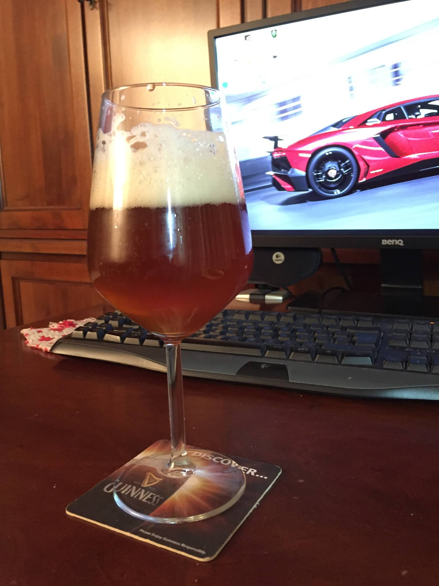

Birra di natale prodotta il 16 agosto 2016. Si trattava di una classica birra di natale, piuttosto alcolica e strutturata. Color ambrato scuro con riflessi rubino. L'ultima bottiglia, bevuta a ferragosto 2018 sembrava un panettone liquido.

### Fermentabili

| Tipologia               | Percentuale |
|------------------------ |-------------|
| Malto Pale              | 89%         |
| Malto Crystal (200 Ebc) | 3%          |
| Malto Chocolate         | 1%          |
| Zucchero candito scuro  | 7%          |

### Luppoli

| Varietà              | Tempo  | Amaro   |
|----------------------|--------|---------|
| Super Styrian Aurora | 60 min | 37 IBU  |
| Styrian Goldings     | 30 min | 1,5 IBU |

### Spezie

| Nome                   | Peso  | Tempo  |
|------------------------|-------|--------|
| Buccia d'arancia amara | 10 gr | 15 min |
| Zenzero                | 10 gr | 15 min |
| Cannella               | 10 gr | 15 min |

### Lievito

Fermentis safbrew abbey  

Avevamo ottenuto una OG più bassa del previsto (1075 contro i 1090) e una FG più bassa (1011 contro 1023) dovuta probabilmente a una fermentazione molto vigorosa e ad alte temperature (26 gradi, ai tempi non avevamo un frigor e il ghiaccio sintetico non bastò). Ci accontentammo di circa 8 gradi (e qualcosa in più dovuti alla rifermentazione).

La birra ci stupì in positivo, se non fosse per un retrogusto di plastica bruciata sulle prime bottiglie stappate (poi quasi sparito dopo mesi). Il corpo era alto, forse leggermente sovracarbonata. Delle spezie ricordo poco, forse perché usate in modo troppo parsimonioso. In compenso ricordo una notevole base maltata, quasi definibile un pane liquido.

Se non si considerano le spezie potrebbe essere considerata uno stile a cavallo fra le belgian strong dark ale e i barley wine. Il lievito infatti, sebbene venga indicato come indicato per le birre belghe simil trappiste ha un profilo aromatico poco caratterizzante per quel tipo di birre. Da riprovare una ricetta simile in futuro, senza l'utilizzo di spezie e con una fermentazione più curata.

