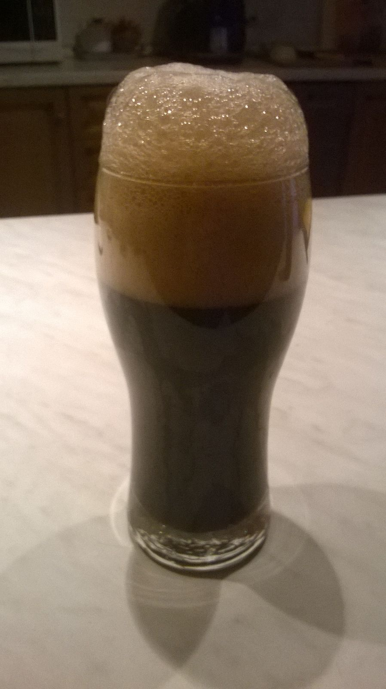
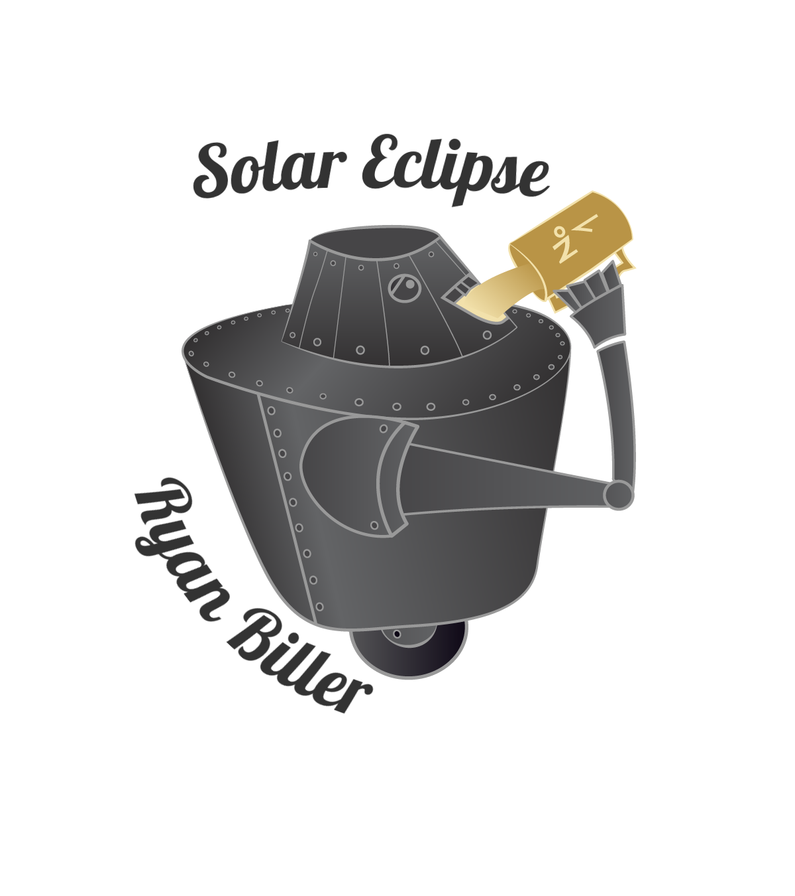

Birra in stile chocolate stout prodotta il 15 luglio 2016 e imbottigliata il 6 agosto.

Più precisamente si tratta di una ricetta irish stout (kit ag birramia) a cui è stato aggiunto un infuso di fave di cacao sotto spirito dopo il travaso.

## Fermentabili

| Tipologia              | Peso   |
|------------------------|--------|
| Malto Pale Maris Otter | 4,3 kg |
| Malto Roast Barley     | 500 gr |
| Malto Black Malt       | 200 gr |

## Luppoli

| Varietà       | Tempo  | Peso  |
|---------------|--------|-------|
| Brewer's Gold | 60 min | 28gr  |
| E.K. Goldings | 30 min | 14 gr |
| E.K. Goldings | 10 min | 14 gr |

## Lievito

Fermentis Safale S-04

## Assaggio

### Aspetto

Decisamente nera, con schiuma marrone abbondante e un po' scomposta.

### Olfatto

Si nota subito un forte aroma di orzo tostato, caffè e cacao.

### Sapore

Uno schiaffo di amaro ti colpisce subito, complici i luppoli, i malti tostati come il black e il roast ed ovviamente le fave di cacao.

### Palato

Il corpo è medio, le bollicine aiutano la bevuta.

Per l'aromatizzazione con infuso di cacao mi sono documentato su vari forum americani.  
Abbiamo preso 50 g di fave (per circa 23 lt di birra) e messe in un barattolo di vetro con 100g di vodka, lasciate per 4 giorni e agitato ogni giorno.  
Per non far si che i grassi presenti nelle fave inibissero la schiuma abbiamo rimosso (e buttato) le fave, messo il barattolo in freezer per una notte e poi tolto la patina sopra ghiacciata (erano i grassi più altre impurità).  
L'estratto così ottenuto lo abbiamo aggiunto durante il travaso in secondaria.

## Logo originale

