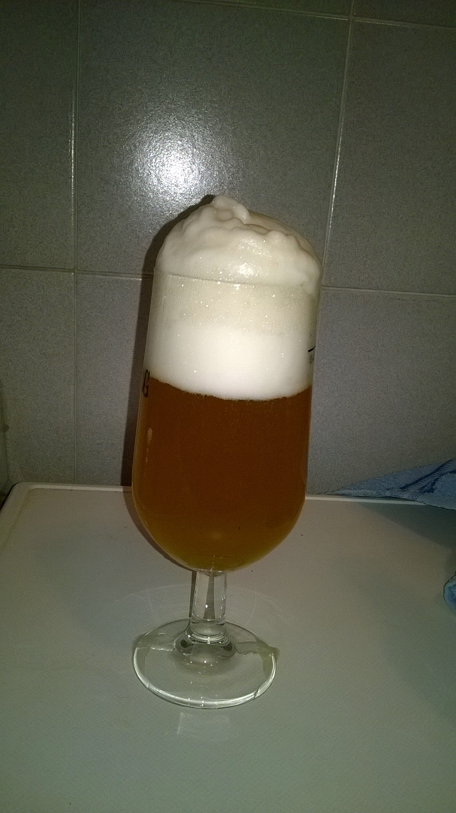

Kolsch prodotta il 27 novembre 2016.

### Fermentabili

| Tipologia     | Percentuale |
|---------------|-------------|
| Malto Pilsner | 90%         |
| Malto Wheat   | 10%         |

### Luppoli

| Varietà              | Tempo  | Amaro    |
|----------------------|--------|----------|
| Super Styrian Aurora | 60 min | 25,5 IBU |
| Styrian Goldings     | 20 min | 2 IBU    |

### Lievito

Fermentis Safale K-97

Questa birra ci diede dei problemi di densità a fine mash (meno di 1050) quindi decidemmo di procedere senza diluire ulteriormente il mosto con lo sparge. Nonostante la winterizzazione spartana sul balcone a pochi gradi la birra restò torbida e sopratutto troppo amara per lo stile. Inoltre quasi tutte le bottiglie scoppiarono o "sgusciarono" tutte nel lavandino.

Nonostante l'esecuzione terribile, questa è decisamente una birra da rifare. Decidendo se sia il caso di tenere il 10% di frumento (saprei distinguerla da un 100% pils?)

