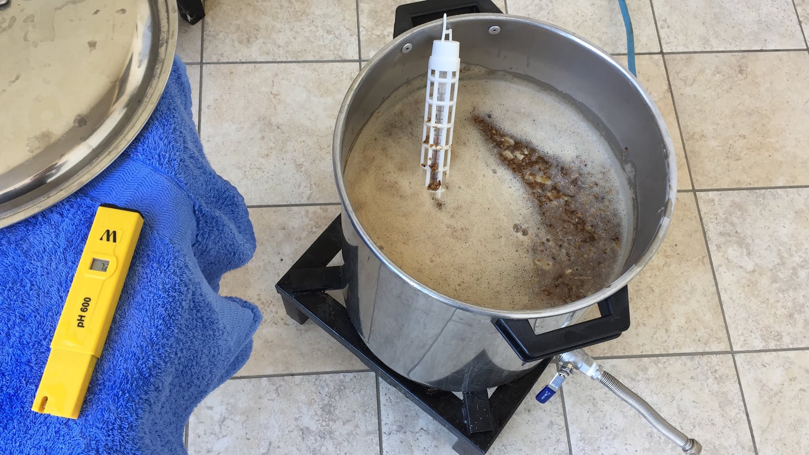

A partire da quello che avevo in casa (molto crystal) e da tutto questo luppolo autocoltivato ho deciso di prendere un bel sacco di pale da 25kg e buttare giù qualche idea. Ne sono nate due amber ale (quasi una evoluzione della [[brew.brews.2016.pale-blue-dot]] “sbagliata ma buona” del 2016).

Rispetto a quest’ultima ha 100 grammi di pale in meno, 50g di crystal in più e un malto speciale che mi ispirava, 300g di special b. So che è più indicato per gli stili belgi scuri come BSDA, quad e dubbel ma leggevo in rete che è usato anche nella arrogant bastard di stone (una amber ale molto luppolata) e quindi perché no.

### Acqua

| Fase   | Quantità  |
|--------|-----------|
| Mash   | 2,9 lt/kg |
| Sparge | 2,9 lt/kg |

### Fermentabili

| Tipologia               | Percentuale |
|-------------------------|-------------|
| Malto Pale              | 90%         |
| Malto Crystal (177 EBC) | 6%          |
| Malto Special B         | 5%          |

### Mash

| Fase     | Temperatura | Durata |
|----------|-------------|--------|
| Mash In  | 68°         | 60 min |
| Mash Out | 78°         | 15 min |

### Luppoli

| Varietà       | Tempo  | Amaro   | Quantità |
|---------------|--------|---------|----------|
| Comet         | 60 min | 31 IBU  | -        |
| Chinook+Comet | 5 min  | -       | 5,2 g/l  |

### Altro

Siccome avevo ancora quasi 500g di cocco da quest’estate (50g usati per la porter in fermentazione) ho deciso di metterne 250g in mash nella prima amber ale e 250g in bollitura nella seconda. Nel primo caso non l’ho contato nel calcolo dell’acqua.

Ho fatto la scelta di non fare dryhopping, non mi fido della pulizia dei luppoli, i quali hanno qualche residuo di foglie e altre impurità quindi ho optato per 5 minuti di bollitura per sterilizzarli. Siccome non esiste una hop bag per contenerli tutti ho usato il filtro del biab (l’arte di arrangiarsi).

Nella seconda amber ho messo anche il cocco nella sacca. Occorre precisare che, essendo il primo raccolto, gli alpha acidi e le componenti aromatiche possono essere minori.

### Fermentazione

Per entrambe ho fatto fermentare in primaria con US-05, dalla prima amber ale ho trasferito quasi 5 litri in una dama e inoculato una fiala di White Labs WLP650 Brettanomyces Bruxellensis e messo a (ri)fermentare in una stanza calda (almeno 22-23 gradi) per almeno un mese senza controllo temperatura.

La seconda amber ale ha subito lo stesso trattamento ma con Omega Yeast Brett Blend #1 Where da funk?. Avrei voluto utilizzare il gemello del WLP650, il 653 lambicus ma non era disponibile. Questo mix è descritto come “miscela di Brettanomyces isolato da una birreria del Colorado e due ceppi di Saccharomyces precedentemente classificati come Brettanomyces”. Sicuramente rimarrà poco zucchero ai due ceppi di saccharomyces visto l’utilizzo in secondaria che dovrebbe far esaltare di più il carattere del brett.

### Impressioni

Le due birre base non mi sono piaciute. Non ho riscontrato infezioni ma un sapore molto monocorde e quasi vinoso (forse lo special b) e decisamente troppo dolce (anche merito dell'attenuazione finale di 1020).

Per quanto riguarda gli esperimenti invece mi hanno colpito in positivo. Gli ho imbottigliati entrambi dopo 3 mesi di maturazione. Dagli ultimi assaggi ho riscontrato tutto il carattere wild del brett e l'acidità è appena percepita solo nella versione brux. In entrambe c'è una nota di frutto rosso che mi piace molto. Ho ancora due bottiglie in cantina da provare il prossimo anno.

