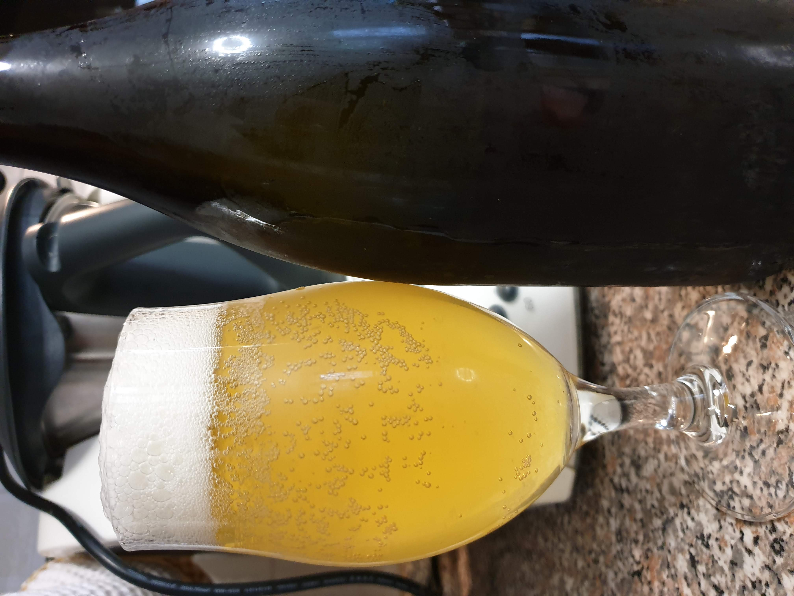

Blonde Ale brassata il 29 ottobre 2017

Il grist era composto dalla classica sfilza di malti da finire, cioè una base maltata di circa metà pale e metà pilsner, più carapils, malto di frumento e fiocchi d'avena.

Per la luppolatura è stato usato il solito herkules da amaro e hallertau blanc per aroma e dry hopping (2,5 g/l in entrambe le gettate).

Lievito US-05.

La birra ha un bel aspetto e una schiuma azzeccata. L'ho trovata un po' watery (non misurai la gravità) e poco alcolica ma mi sembra ben attenuata. Non mi piace molto la componente aromatica del luppolo, molto scialba, mi aspettavo di più dall'hallertau blanc vista la sua descrizione. Non ho ritrovato appunto il tropicale/uva spina descritti ma sapori più erbacei da luppoli continentali.

Forse è meglio descriverla come una normale blonde ale/pale ale.

