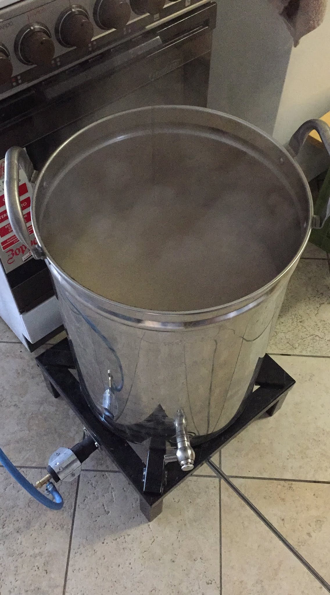

Dubbel prodotta il 24 febbraio 2017.

### Fermentabili

| Tipologia                  | Percentuale |
|----------------------------|-------------|
| Malto Pilsner              | 72%         |
| Malto Vienna               | 8%          |
| Malto Crystal (200 Ebc)    | 3%          |
| Malto Cara Rosso (150 Ebc) | 6%          |
| Zucchero candito scuro     | 8%          |
| Malto Cara Pilsner         | 3%          |

### Luppoli

| Varietà            | Tempo  | Amaro   | Quantità |
|--------------------|--------|---------|----------|
| Hallertauer Magnum | 60 min | 31 IBU  | -        |
| Styrian Goldings   | 15 min | 1,6 IBU | 0,65 g/l |
| Styrian Goldings   | 5 min  | 0,6 IBU | 0,65 g/l |

### Lievito

Fermentis Safbrew T-58

### Commenti

Non preoccupatevi per il grist, è così inutilmente complesso perché avevo molti malti speciali da finire. Per il resto sebbene mi sembrava quadrare come ricetta, la cotta si infettò quindi è ingiudicabile.
Il motivo dell'infezione è probabilmente da ricondurre al fermentatore con fondo graffato e non saldato, non più utilizzato da allora.

