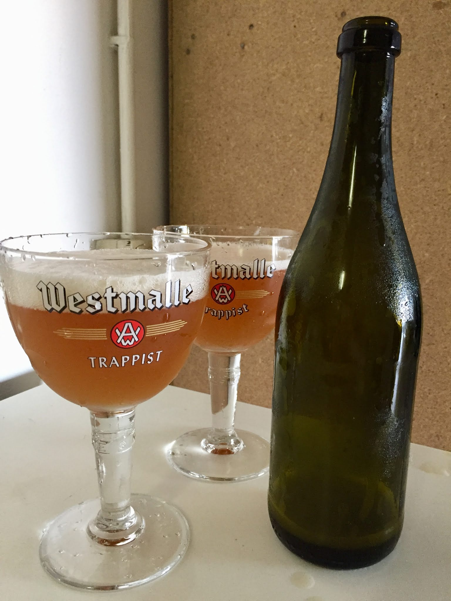

Tripel prodotta il 24 gennaio 2017.

### Fermentabili
| Tipologia               | Percentuale |
|-------------------------|-------------|
| Malto Pilsner           | 53%         |
| Malto Vienna            | 37%         |
| Zucchero candito chiaro | 7%          |
| Miele                   | 3%          |

### Luppoli
| Varietà            | Tempo  | Amaro   | Quantità |
|--------------------|--------|---------|----------|
| Hallertauer Magnum | 60 min | 15 IBU  | -        |
| Styrian Goldings   | 20 min | 3,7 IBU | 1,5 g/l  |
| Saaz               | 20 min | 4,1 IBU | 1,5 g/l  |
| Styrian Goldings   | 5 min  | 1,6 IBU | 2 g/l    |
| Saaz               | 5 min  | 1,8 IBU | 2 g/l    |
| Saaz               | DH     | -       | 2 g/l    |

### Lievito
Mangrove Jack's Belgian Tripel M31

### Commenti
Stranamente gli stili belgi difficili da padroneggiare come questa tripel e la saison di fine 2016 vennero decisamente sopra la media. 

All'inizio la trovai un po'esuberante, troppo fenolico e alcol pungente. Parvenze da saison, ma poi provai una westmalle tripel e ci ritrovai un po' di quella rusticità che pensavo fosse fuori stile. 

Il luppolo (in aroma) è forse troppo per un'esecuzione accademica ma l'idea di una tripel luppolata mi intrigava e poi ne avevo molto da finire. 
Le ultime bottiglie bevute dopo 6 mesi raggiunsero un grande equilibrio e risultarono pericolosamente beverine (per il grado alcolico). 

Da riprovare sicuramente, magari con il liquido White Labs WLP530 o Wyeast 3787 che sembrano essere il ceppo Westmalle.

