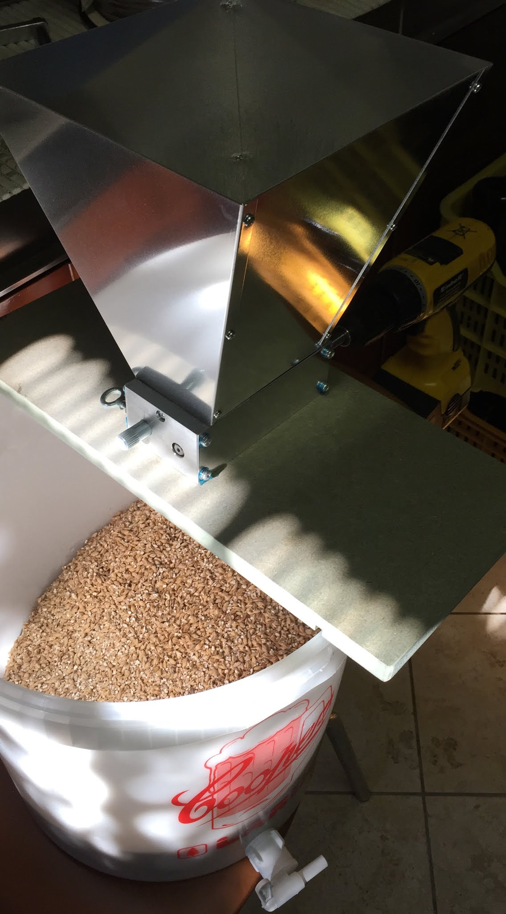

Pils brassata a cavallo fra gennaio e febbraio 2017 (data ignota).

## Fermentabili

| Tipologia     | Percentuale |
|---------------|-------------|
| Malto Pilsner | 94%         |
| Cara Pils     | 6%          |

## Luppoli

| Varietà            | Tempo  | Amaro    | Quantità |
|--------------------|--------|----------|----------|
| Hallertauer Magnum | 60 min | 32,4 IBU | -        |
| Saaz               | 20 min | 4,4 IBU  | 1,4 g/l  |
| Saaz               | 5 min  | 1,9 IBU  | 1,8 g/l  |
| Saaz               | DH     | -        | 1,4 g/l  |

## Lievito

Mangrove Jack's Bohemian Lager M84

## Commenti

Come la lager precedente questa subì un trattamento simile che la rese ossidata, leggermente acida (forse infezione portata dentro con uno dei travasi) e imbevibile. Data la mia poca fortuna con le basse fermentazioni ho sospeso questo tipo di birre. Ci riproverò quando la costanza sarà migliore.

