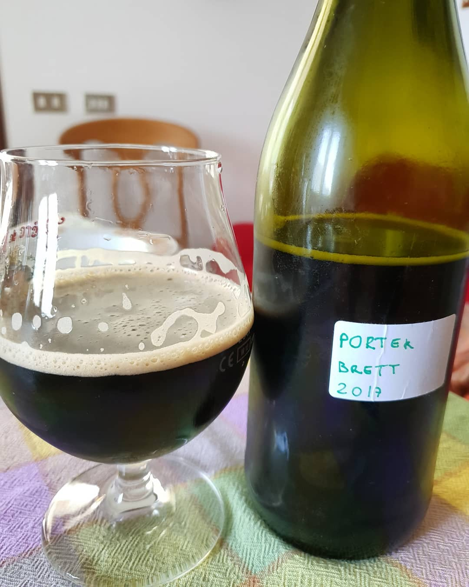

Robust Porter prodotta il 9 luglio 2017.

### Fermentabili

| Tipologia         | Peso   |
|-------------------|--------|
| Malto Pale        | 4 kg   |
| Malto Carapils    | 200 gr |
| Malto Wheat       | 200 gr |
| Chocolate         | 200 gr |
| Crystal           | 300 gr |
| Zucchero Demerara | 500g   |

### Luppoli

| Varietà              | Tempo  | Amaro   | Quantità |
|----------------------|--------|---------|----------|
| Hallertauer Herkules | 60 min | 40 IBU  | -        |

### Lieviti

| Variante               | Nome                                       |
|------------------------|--------------------------------------------|
| Fermentatore (10,5 lt) | Fermentis Safale US-05                     |
| Dama (4,5 lt)          | White Labs WLP645 Brettanomyces Claussenii |

### Commenti

La ricetta è molto simile alla [Self Assembly Pope](https://brewdogrecipes.com/recipes/self-assembly-pope) di Brewdog, con la differenza dei lieviti e leggermente le percentuali dei malti.

Ho diviso il mosto in due fermentatori, nel fermentatore principale ho fatto fermentare regolarmente con US-05 e dopo una settimana ho inserito un infuso a base di vodka con tre baccelli di vaniglia e 50g di cocco tostato in scaglie.  
Al momento dell'imbottigliamento la birra non mi convinceva, c'era un forte odore chimico tipo solvente/etilico all'apertura del fermentatore ma la birra non sembrava acidificata/infetta quindi procedetti ad imbottigliare.

In una dama da 5lt invece ho fatto fermentare il mosto senza controllo temperatura (in cantina d'estate a circa 25 gradi) con il lievito liquido White Labs WLP645 Brettanomyces Claussenii, inoculando direttamente la fiala (per circa 4,5 litri non mi sono preoccupato di calcolare vitalità e tasso di inoculo).

La fermentazione è durata oltre tre settimane (ci ha messo almeno una settimana a mostrare le prime bolle in superficie), al termine della quale ho travasato in un fermentatore piccolo e ho aggiunto le scaglie di quercia (francese a tostatura intensa) sterilizzate precedentemente in acqua bollente. Ho lasciato a contatto circa una settimana prima di imbottigliare.  
Ho imbottigliato solo bottiglie da 75cl usando il misurino da kit per le bottiglie da 33cl (che era tarato su carbonazioni alte) per evitare bombe a mano.

All'assaggio della versione normale trovai la birra non infetta ma non sentii nemmeno le spezie aggiunte (non userò più alcool la prossima volta), quindi una birra passabile ma nemmeno memorabile. Aromi di tostato, cioccolato ma un po' scialbi. Inferiore alle scure fatte in precedenza. Ci trovai un difetto difficile da descrivere, forse un aroma di gomma bruciata, dovuto probabilmente alla fermentazione.

La versione brettata invece, assaggiata a fine ottobre (tre mesi dopo l'imbottigliamento), era molto migliore. Lieve funky, molto fruttato e un gradevole sapore di legno. Da valutare l'evoluzione del brett nei prossimi mesi.
Aggiornamento: bevuta a maggio e agosto 2018 risulta notevolmente migliorata, brett protagonista con lieve acidità acetica accentuata.
