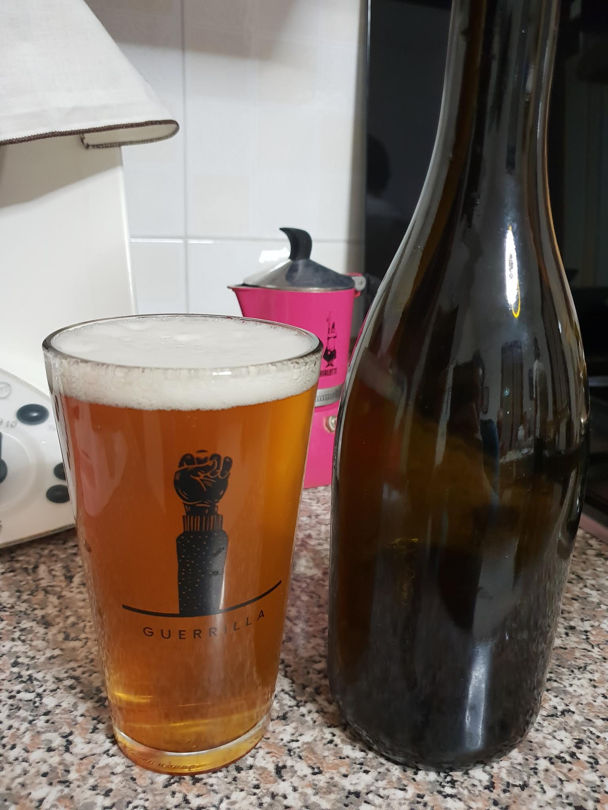

Golden Ale brassata il 26 agosto 2018.

## Fermentabili

| Tipologia      | Percentuale |
|----------------|-------------|
| Malto Pale     | 94%         |
| Malto Cara Red | 6%          |

## Luppoli

| Varietà                         | Tempo  | Amaro    | Quantità |
|---------------------------------|--------|----------|----------|
| Comet                           | 60 min | 21,5 IBU | -        |
| Cascade/chinook (autocoltivato) | 5 min  | -        | 3 g/l    |
| Cascade/comet (autocoltivato)   | DH     | -        | 3 g/l    |

## Lievito

Lallemand Windsor

## Log

| Misura                | Valore       | Quando                   |
|-----------------------|--------------|--------------------------|
| Litri in fermentatore | 9,5/10 litri | Dopo la cotta            |
| OG                    | 1046         | Dopo il mash             |
| OG                    | 1056         | Dopo la bollitura        |
| FG                    | 1018         | 01/09/2018               |
| Cold Crash            | -            | 04/09/2018 -> 08/09/2018 |
| Imbottigliamento      | 5,75 litri   | 09/09/2018               |
| Priming               | 5,8 g/l      | -                        |

## Criticità rilevate

Il dry hopping libero ha assorbito molto luppolo e impedito il pescaggio dal rubinetto degli ultimi litri inzuppati nei coni.

## Impressioni

Schiuma fine, poco persistente, colore dorato simile alla trap, forse leggermente più scura, limpida nonostante il lievito fosse dichiarato come poco flocculante e il generoso DH.

Il corpo è medio, la leggera dolcezza residua controbilancia bene l’amaro ben definito e direi nei range dello stile. Molto beverina, carbonazione azzeccata per uno stile inglese.

Aroma di luppolo ben presente, direi al limite per una golden ale, più in territorio american pale ale (l'avrei definita così dopo il primo assaggio).

Da notare che fino alla fine della bollitura la ricetta è la fotocopia della trap, quindi l'amaro in più è unicamente da associare ai fiori negli ultimi minuti, raccolto a settembre 2017 ma decisamente più in forma dello yeoman 2018, anche in aroma.

Ne fare dry hopping con coni autocoltivati (senza l'utilizzo di fitosanitari) mi sono preso un piccolo rischio infezione ma sembra essere stato scongiurato dal grado alcolico non proprio basso ma soprattutto dal fatto che erano stati un anno in congelatore sottovuoto.

Purtroppo ho imbottigliato pochi litri, molti dei quali sono stati assorbiti dai coni di luppolo in dry hopping, che hanno anche impedito al rubinetto di pescare correttamente gli ultimi litri.

La densità maggiore è dovuta forse dal recircolo che ha permesso di estrarre più zuccheri (non ho misurato la densità preboil) e/o, più probabilmente, dalla bollitura vigorosa con la resistenza al massimo, fatta per concentrare il mosto visto che nella precedente cotta, con la bollitura fiacca, avevo avanzato qualche litro di troppo.

