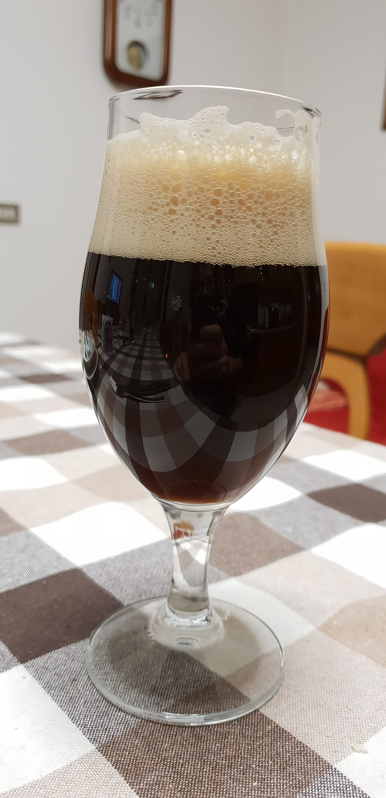

Roggenbier, cotta del 2 novembre 2018

## Fermentabili

| Tipologia       | Percentuale |
|-----------------|-------------|
| Malto Pilsner   | 31%         |
| Malto di segale | 31%         |
| Malto Vienna    | 15%         |
| Monaco II       | 15%         |
| Caramonaco      | 6%          |
| Chocolate       | 2%          |

## Luppoli

| Varietà                | Tempo  | Amaro    | Quantità |
|------------------------|--------|----------|----------|
| Hallertauer Mittelfruh | 60 min | 13,5 IBU | -        |
| Hallertauer Mittelfruh | 20 min | 5,4 IBU  | -        |

## Log

| Misura                | Valore       | Quando                   |
|-----------------------|--------------|--------------------------|
| Litri in fermentatore | 9 litri      | Dopo la cotta            |
| OG                    | 1060         | Dopo la cotta            |
| FG                    | 1016         | 18/11/2018               |
| Cold Crash            | -            | 18/11/2018 -> 24/11/2018 |
| Imbottigliamento      | -            | 25/11/2018               |
| Priming               | 6 g/l        | -                        |

## Storia

Questa è probabilmente la birra meno riuscita dell'anno, anche grazie all'odissea della cotta ma d'altronde è meglio aver una birra mediocre che non averla. La ricetta è fatta seguendo le linee guida della [giornata nazionale degli hb del 2018](https://www.movimentobirra.it/mobi-giornata-nazionale-hb-2018/), quindi niente di testa mia, anche se le percentuali sono abbastanza "simmetriche".

Per il luppolo ho aperto una busta di hellertau mittelfruh annata 2015, in scadenza alla fine dell'anno. Essendo pellet sottovuoto sempre conservato in freezer dal 2016 l'ho usato dopo averlo annusato per evitare spiacevoli aromi.

## Impressioni

Aspetto ok, colore marrone scuro con riflessi rubino, mi sembra anche limpida per quel poco che si può vedere con questa colorazione (ho winterizzato anche questa, chiamatela kristalroggenbier 😀).

Non ha carbonato bene ed è un po' piatta (decisamente se deve avere la stessa carbonazione di una weizen), il corpo mi sembra medio-basso.

Si sentono ovviamente i malti monaco in primo piano, per il resto sapori un po' poco intensi e slegati anche se comunque si riscontra bene il tipico profilo del lievito weizen (leggevo [in giro](https://odetozymase.wordpress.com/2015/01/06/the-weihenstephan-strain-wlp300wy3068-saccharomyces-or-torulaspora-part-1/) che potrebbe contenere S.delbrueckii) e anche quella speziatura riconducibile alla segale, uno dei pochi malti che riesco a riconoscere dopo aver bevuto alcune artigianali con questo ingrediente.  
Pensavo che quella sfumatura speziata fosse tutta prodotta dal lievito (simile alle dubbel) finché non ho provato un' imperial rye porter.

Sicuramente è una birra bevibile e fa il suo dovere durante i pasti, è anche al di sopra delle aspettative se si considera che ero sul punto di buttare la cotta visto che quella che mi distrusse l'impianto biab elettrico.

