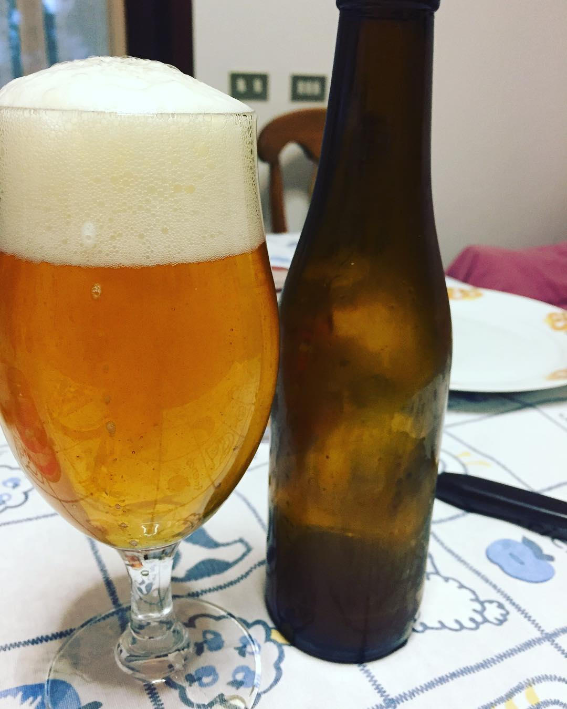

Prima birra del 2018 una Belgian Pale Ale prodotta l'8 luglio.

Il 2018 è stato l'anno in cui sono ripartito da solo e ho fatto solo quattro birre nella seconda metà dell'anno. Nonostante le rogne all'impianto mi ritengo più che soddisfatto dai risultati, buone birre, migliorabili in vari aspetti ma perfettamente bevibili (a conferma di ciò sono le scarse giacenze nel 2019).

### Fermentabili
| Tipologia      | Percentuale |
|----------------|-------------|
| Malto Pale     | 94%         |
| Malto Cara Red | 6%          |

### Luppoli
| Varietà                | Tempo  | Amaro   | Quantità |
|------------------------|--------|---------|----------|
| Comet                  | 60 min | 15 IBU  | -        |
| Yeoman (autocoltivato) | 5 min  | -       | 3 g/l    |

### Lievito
Lallemand Abbaye

### Log
| Misura                | Valore       | Quando                   |
|-----------------------|--------------|--------------------------|
| Litri in fermentatore | 9,5/10 litri | Dopo la cotta            |
| OG                    | 1050         | Dopo la cotta            |
| FG                    | 1007         | 14/07/2018               |
| Cold Crash            | -            | 14/07/2018 -> 20/07/2018 |
| Imbottigliamento      | -            | 21/07/2018               |
| Priming               | 5,8 g/l      | -                        |

### Impressioni
Schiuma generosa ma evanescente, ottima beva (ad agosto era essenziale), forse un po' watery per via della carbonazione non troppo alta (devo aggiustare il tiro col corn sugar) o delle reali temperature di mash più basse vista la mancanza di ricircolo.

Luppolo poco pervenuto in aroma, strano visto che era stato raccolto poco prima della cotta, si trattava probabilmente di luppolo troppo prematuro e con poche resine viste le eccezionali temperature della primavera scorsa (infatti poi è rifiorito a settembre).

L'amaro percepito è leggermente basso (dagli assaggi del mosto prima/dopo la fermentazione sembrava più amara), 10 grammi all'inizio della bollitura erano probabilmente pochi dato che l'amaro apportato alla fine della bollitura è ignoto ma sicuramente scarso.  
L'aleatorietà degli IBU finali è proprio il motivo per cui uso il mio luppolo solo alla fine della bollitura mentre quello commerciale in pellet, di cui conosco gli alpha acidi, all'inizio.

Il profilo del lievito l'ho trovato convincente, tipico belga quindi leggermente fenolico e fruttato ma non maleducato da saison (no rusticità eccessiva).

