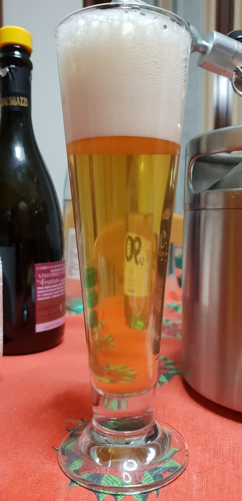
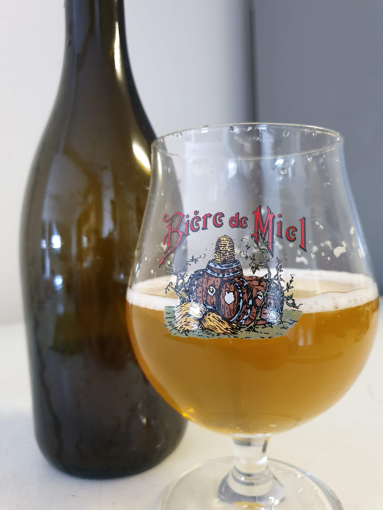

Blonde ale generica, prodotta il 17 ottobre 2018. Una parte in dama sperimentale con lieviti e batteri di lambic.

### Fermentabili
| Tipologia    | Percentuale |
|--------------|-------------|
| Malto Vienna | 100%        |

### Luppoli
| Varietà               | Tempo  | Amaro   | Quantità |
|-----------------------|--------|---------|----------|
| Comet                 | 60 min | 18 IBU  | -        |
| Comet                 | 20 min | 11 IBU  | -        |
| Comet (autocoltivato) | 5 min  | -       | 3,3 g/l  |

### Lieviti
| Variante            | Nome                      |
|---------------------|---------------------------|
| Fermentatore (7 lt) | Fermentis Safbrew S-33    |
| Dama (4,5 lt)       |  Wyeast 3278 Lambic blend |

### Log
| Misura           | Valore       | Quando                   |
|------------------|--------------|--------------------------|
| OG               | 1035         | Dopo il mash             |
| FG               | 1009         | 24/10/2018               |
| Cold Crash       | -            | 24/10/2018 -> 28/10/2018 |
| Imbottigliamento | 4,75 litri   | 28/10/2018               |
| Priming          | 5,8 g/l      | -                        |

### Storia
Questa birra inizialmente era stata progettata per essere una iga, poi per motivi che non ricordo ho deciso di procedere senza mosto d'uva bianca. Nella dama sperimentale era previsto l'uso di uva aggiunta in fermentazione (intera, schiacciata e non pastorizzata) ma anche qui ho proceduto senza. 

L'ho tenuta a maturare per diversi mesi senza controllo di temperatura. Ha lagherizzato a una decina di gradi durante l'inverno.

### Cotta
La cotta si concluse con l'otturazione quasi istantanea del rubinetto in assenza del doppiofondo usato per le due cotte precedenti (fondamentale per filtrare i coni) e portai tantissimo trub nel fermentatore (con l'autosifone che odio TANTISSIMO 😠). Non ho nemmeno misurato l'OG post boil in quel casino.

Nonostante tutto la birra è venuta limpida, è bastata solo la winterizzazione e meno paranoie su torbidità del mosto, travasi, autolisi, gelatine, irish moss ecc...

Solo in ultimo mentre imbottigliavo cominciavano a passare dei grumi di lievito un po' grossi (che poi ho visto che galleggiavano), magari un filtro bouncer avrebbe aiutato.  L'unico lato negativo è che ho imbottigliato pochi litri, soltanto 4,75.

Ho anche bollito per 90 minuti per concentrare di più il mosto perché pensavo di averne troppi a fine bollitura invece ne ho avuti un po' meno del previsto.

### Impressioni
Passando alle impressioni della birra, il vienna dà un vago sottofondo maltato che con l'amaro del luppolo si sposa bene anche se non lo sento in aroma.

È davvero strano come un'ale fatta con S-33, descritto dai vari venditori come fruttato/floreale e adatto per birre belghe blanche/trappiste, solo malto vienna e luppoli americani abbia un profilo così neutro e più simile ad una kolsch se non addirittura lager.

Anche (e sopratutto) dall'aspetto. Se dovessi indovinare gli ingredienti avrei detto sicuramente malto pils, lievito lager o german ale e qualche luppolo nobile solo in aroma o al massimo a 30'.

Se da un punto di vista pratico è forse la birra migliore che ho prodotto (sicuramente all'aspetto) mi ha anche fatto crollare tantissime certezze, tanto da aver un prodotto decisamente diverso da come me l'aspettavo.

Qualche domanda/dubbio/provocazione:
- Il lievito è realmente diverso da come lo descrivono? Che senso ha dire che ha un profilo molto fruttato, floreale (forse questo è l'unico aspetto che ho riscontrato insieme all'alta flocculazione) e belga quando sembra diametralmente opposto?
- Sembra che il vienna sia da usare col bilancino, tanto che molti hb fanno dei grist utilizzandolo in piccola percentuale e magari con birre luppolate. Come diavolo fanno a sentirne la differenza?
- Una birra del genere, fatta con tutti i crismi del low oxigen brewing (almeno nella parte fredda), con tutto in contropressione e senza rifermentazione sarebbe venuta così diversa?

Per quanto riguarda la versione brettata assaggiata intorno a pasqua 2019 le impressioni sono pressoché positive: gentile presenza del brett in aroma, forse solo un po' monotematica e poco complessa. 

Acidità non pervenuta, la quale lascia dedurre che i lacto/pedio del mix di lieviti sono stati completamente neutralizzato dal luppolo, che non era nemmeno stato filtrato efficacemente durante la cotta. Per utilizzarli efficacemente servono molti pochi IBU e altre accortezze produttive. Oppure affidarsi in modo sicuro e affidabile al **kettle sour**.

