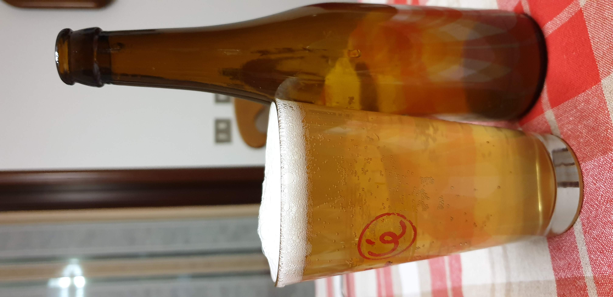

La birra migliore del 2019 è stata prodotta negli ultimi giorni dell'anno e l'ho finita quasi tutta da solo nel primo lockdown.

### Fermentabili
| Tipologia           | Percentuale |
|---------------------|-------------|
| Malto Pilsner       | 58%         |
| Fiocchi di frumento | 42%         |

### Luppoli
| Varietà                         | Tempo  | Amaro    | Quantità |
|---------------------------------|--------|----------|----------|
| Hallertau Hersbrucker           | 60 min | 10 IBU   | 20g      |
| Hallertau Hersbrucker           | 20 min | 9 IBU    | 30g      |

### Spezie
A pochi minuti dalla fine ho messo 5g di coriandolo e una buccia di un arancia intera (essicata sulla stufa il giorno prima)

### Lievito
Mangove Jack Wit M21

### Assaggio
La birra inizio a 1050 e finì a 1018 senza schiodarsi più (dannato M21) quindi risultò una birra tendenzialmente dolce ma nonostante ciò aveva un corpo basso ed era molto beverina. Il coriandolo si sentiva molto e secondo me è l'ingrediente fondamentale per una blanche. Non sono stato in grado di sentire l'arancia. Il lievito è risaputo essere un piantagrane come molti altri ceppi mangrove, cioè fermentano velocemente però si piantano a una densità finale piuttosto alta. Gasatura giusta con il solito priming quindi è proprio il lievito che detesta zuccheri appena più complessi del destrosio. Ma più con questo lievito ovviamente, piuttosto mi sbatterò per fare uno starter con un liquido belga e ossigenare il mosto dopo la bollitura. Anche perché per me il mondo belga dev'essere ben secco, scuola extraomnes. Questa aveva la densità finale da quadrupel se non di più...

