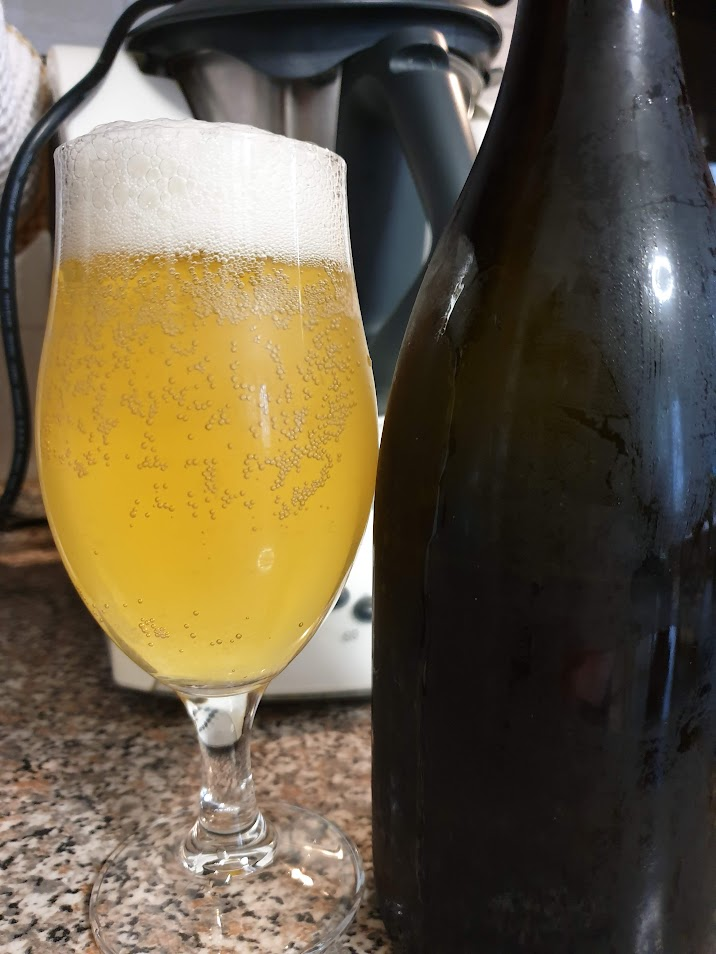

Una birra semplice fermentata con US-05

## Fermentabili

| Tipologia     | Percentuale |
|---------------|-------------|
| Malto Pilsner | 94%         |

## Luppoli

| Varietà | Tempo  | Amaro   | Quantità |
|---------|--------|---------|----------|
| Comet   | 30 min | 25 IBU  | 25 g     |
| Comet   | 15 min | 19 IBU  | 30 g     |
| Comet   | 0 min  | 0 IBU   | 34 g     |

## Lievito

Fermentis Safale US-05

## Assaggio

Con questa birra feci un errore molto grave, ossia utilizzare grani macinati dal venditore che sono stati li per molto tempo. La birra era quindi influenzata fortemente da un sapore di malto ossidato.

