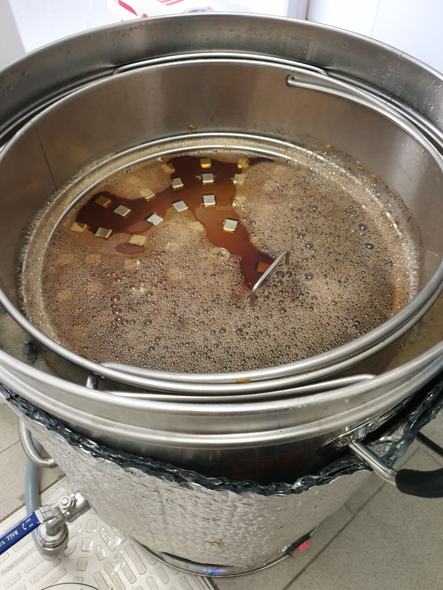

Imperial Porter svuotadispensa prodotta il 26 aprile 2019.

### Fermentabili
| Tipologia          | Percentuale |
|--------------------|-------------|
| Malto Pale         | 59%         |
| Malto Pilsner      | 16%         |
| Malto Carared      | 7%          |
| Malto Chocolate    | 7%          |
| Malto Special B    | 5%          |
| Malto Black        | 3%          |
| Zucchero Muscovado | 3%          |

### Luppoli
| Varietà              | Tempo  | Amaro   | Quantità |
|----------------------|--------|---------|----------|
| Comet                | 60 min | 30 IBU  | -        |

### Fermentazione
| Variante               | Nome                        |
|------------------------|-----------------------------|
| Fermentatore (10,5 lt) | Fermentis Safale S-04       |
| Dama (4,5 lt)          | Fermentis Safale US-05 + DH |

### Cotta
La seconda cotta con il biap è filata liscia come la prima, con l'unica differenza dell'aggiunta di un cappotto fatto con materiale plastico isolante. Ho avuto una tangibile riduzione dei tempi delle soste, in particolare la rampa per la bollitura.

Anche le varie correzioni del ph mi hanno costretto a misurarlo più volte, per poi desistere al ph di 5,7 (un po' alto). 

Ho avuto però problemi a calcolare la densità, se il rifrattometro dopo il mash mi diceva 21 brix ovvero 1087 dopo la bollitura il densimetro (con il trub non finito in fermentatore) si fermava a 1070. Chi dei due ha ragione? Probabilmente sono più propenso a un valore intorno al 1080, che complice la densità finale di 1020 darebbe un valore alcolico di 8%. Dalle mie impressioni la birra ha ALMENO 8 gradi, perché è davvero impegnativa.

Non ho misurato nemmeno l'andamento della fermentazione visto che il tilt era scarico perché riposto per mesi in posizione errata (quella orizzontale) che lo ha lasciato acceso e non spento.

### Variante Dry Hopped
La dama sperimentale da 4,5 lt è stata riempita con 50 grammi di chinook in coni (autocoltivati). Dato l'assorbimento del luppolo sono stati imbottigliati poco più di 3 litri.

Al primo assaggio di una bottiglia da 33 dopo sole due settimane la birra mi aveva colpito per l'intensità aromatica del luppolo che ben si sposava con la base, ma aveva ovviamente ancora qualche spigolo da limare visto che si tratta di una birra ben alcolica.  
Le stesse sensazioni però non sono state confermate dalla versione spillata dal fusto che inizialmente aveva un metallico/ematico fastidioso, anche se quasi sparito nelle successive spillature (anche meno carbonate). Forse era solo co2. Speriamo.  
Nonostante questo rimane un po' astringente e spigolosa, anche se sono ben presenti gli aromi delle imperial porter/stout ossia cioccolato, melassa e un po' di caramellato. In chiusura ho sentito un bel retrogusto di nocciola che mi ha rincuorato visto la schifezza della prima spillata.

La variante senza DH inizalmente doveva essere maturata con l'aggiunta di scaglie di rovere e estratto di vaniglia ma me ne sono dimenticato. In ogni caso la aprirò nell'autunno viste le temperature proibitive per queste birre.

