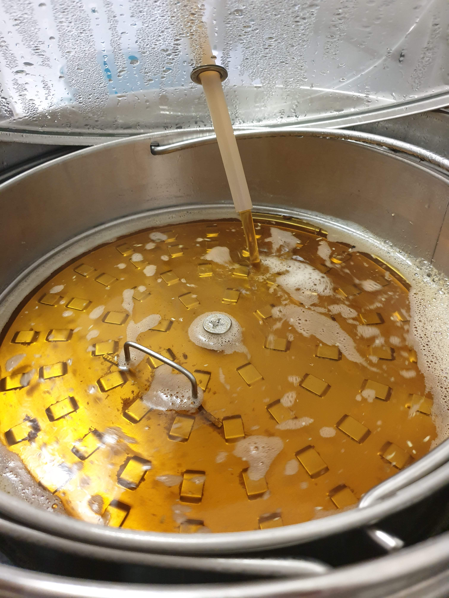
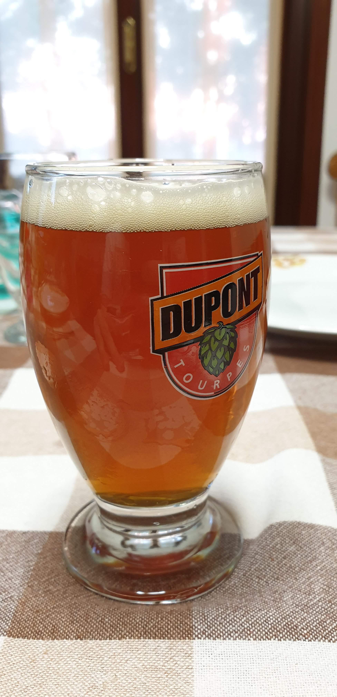
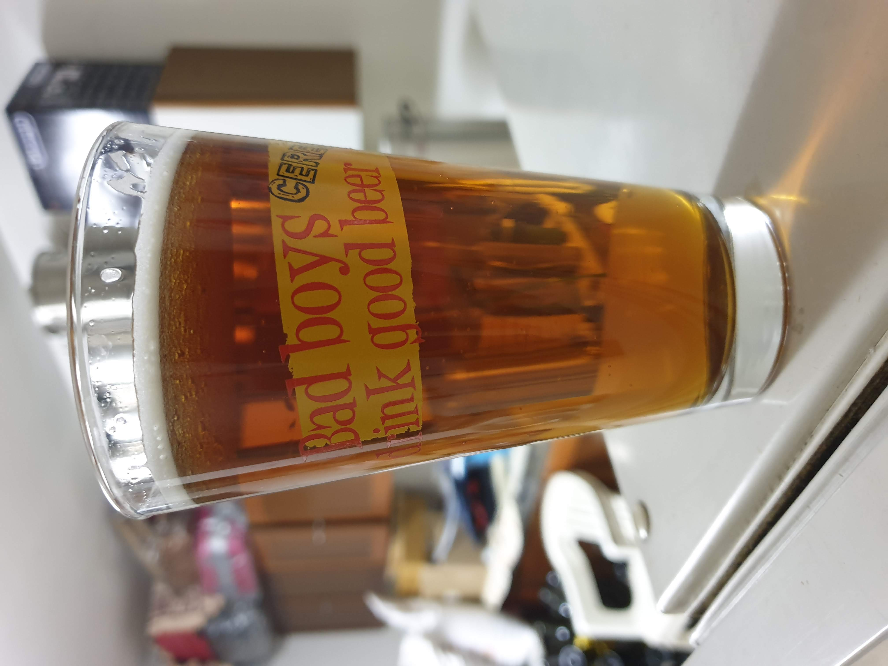

Primo reciclo dell'hornidal kveik, stavolta con base diversa e aggiunta di sapa in bollitura.

## Fermentabili

| Tipologia          | Percentuale |
|--------------------|-------------|
| Malto Pilsner      | 65%         |
| Malto Vienna       | 11%         |
| Malto Munich 20L   | 11%         |
| Malto Carared      | 4%          |
| Malto Special B    | 4%          |
| Sapa di uva bianca | 4%          |

## Luppoli

| Varietà              | Tempo  | Amaro   | Quantità |
|----------------------|--------|---------|----------|
| Comet                | 60 min | 30 IBU  | -        |

## Lievito

Fermentis Safale US-05

## Cotta

La cotta è filata senza particolari impedimenti. Non ho però usato il cappotto termico fatto in materiale plastico coibentante e ci ha messo 30 minuti per arrivare in bollitura dai 66° del mash.

Ho avuto però qualche problema con densimetro e rifrattometro in preboil. Se il primo mi misurava 11,5/12 brix ovverò circa 1048, il campione nel densimetro (preso dal gocciolamento del cestello in un secchio dopo averlo tolto), a temperatura ambiente, segnava 1058. L'OG finale era di solo 1052, nostante gli zuccheri apportati dal mosto. Ho avuto quindi un'efficenza ridicola, che non calcolo nemmeno.

## Impressioni

Ho imbottigliato questa cotta domenica 30 producendo 14 bottiglie da 75cl e un fustino da 2 litri. Quando assaggiai la birra piatta prima dell'imbottigliamento avvertì un brivido lungo la schiena. Se al naso sentivo un ottimo aroma fruttato, quasi tropicale in bocca sentì un amaro sgraziato seguito da una netta nota metallica che definirei quasi ematica.

Flashback traumatici del 2017, lager metalliche e imbevibili.  
Ci siamo, si è infettata, *buttatutto*.

Ho comunque imbottigliato con qualche paranoia, con la vaga speranza che il bruco si tramutasse in farfalla.
Ho aperto la prima bottiglia mercoledì 10, con una remota speranza che l'assaggio dal fermentatore venne falsato dai *raggi cosmici*.  
E sorprendentemente la birra era salva. E bella.

Un bel aroma (sia al naso che in bocca) che mi ricorda il miele, ma soprattutto il mosto d'uva bianca concentrato (bollito per 5 ore) che avevo ovviamente assaggiato.  
Si era ovviamente scurito e ha donato un bel colore ramato carico alla birra finita.  
Mi ricorda la Biere du Miel di Dupont, vista l'affinità aromatica.

In bocca si sente una certa dolcezza residua però bilanciata dall'amaro e sopratutto dalla lieve asprezza tipica dell'uva/vino.  
La birra sembra abbastanza carbonata ma meno di quanto sembrava all'apertura della bottiglia, una bomba a mano che ha leggermente sgusciato come uno champagne. Non avendo controllato la densità finale (molto male) potrebbe essere che il lievito ha continuato a lavorare sul mosto oltre che allo zucchero di rifermentazione (5,6 g/l come quasi tutte le mie birre).

Ovviamente seguiranno maggiori assaggi per valutarne l'evoluzione nel tempo. Sperando che le bottiglie non esplodano tutte...

Dopo quasi un anno dalla cotta la dolcezza si è via via persa ed era più secca e beverina. Questo non è dovuto da un cambiamento di densità (è sempre stata in frigo) ma da una perdita dell'aroma fresco e fruttato. Mi sembrava virare di più sul vinoso che sul miele come nei primi assaggi. La preferivo fresca tuttavia la lunga maturazione a freddo le ha fatto acquisire un aspetto molto più limpido.

