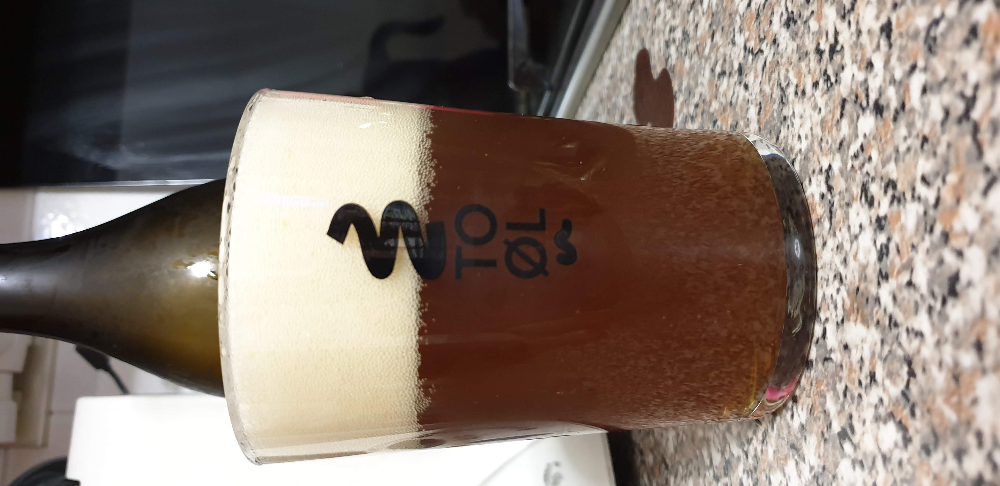

Un altro tentativo di trovare una buona base per la birra luppolata della casa. Ho sostituito il 6% di carared con un malto speciale più scuro.

## Fermentabili

| Tipologia          | Percentuale |
|--------------------|-------------|
| Malto Pilsner      | 94%         |
| Malto Carabohemian | 20%         |

## Luppoli

Solo comet autocoltivato, anche in dry hopping

## Lievito

Fermentis Safale US-05

## Assaggio

Fu la prima volta che provai questo malto speciale e me lo ricordo come un malto più leggero dello special b ma con caratteristiche molto simili in termini organolettici, quindi la solita crosta di pane molto cotta e uvetta.

In questa birra di luppolo autocoltivato il dryhopping si faceva sentire ma dopo un breve periodo di maturazione il luppolo lasciava spazio al sapore di malto.

Come aspetto le prime volte si presentava di un colore molto brutto perché aggravato dall'opacità, dopo un po' di tempo in frigo le cose sono migliorate (ma non ho foto per provarlo)

