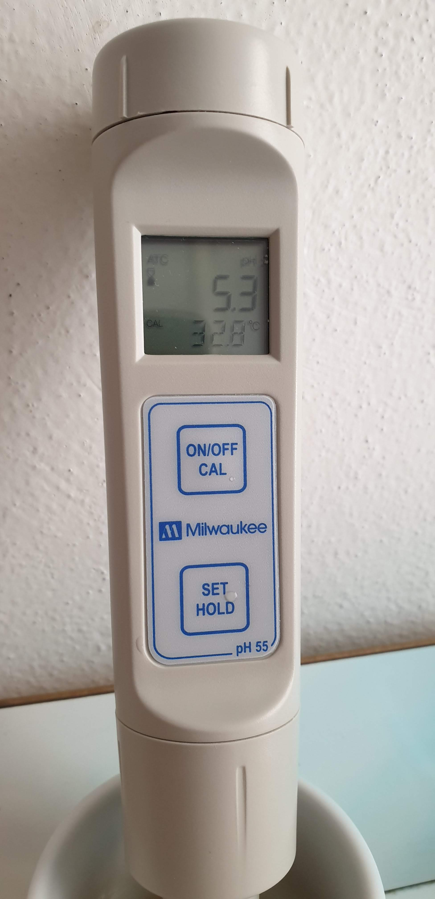
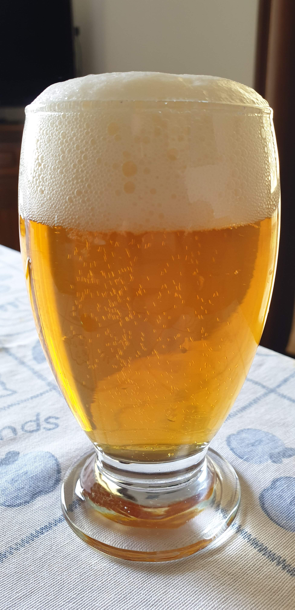

Banco di prova per l'hornidal kveik, stessa base e quasi stessa luppolatura della plug walk.

## Ricetta

Per la ricetta rimando alla [[brew.brews.2019.plug-walk]] perché è uguale, con a differenza appunto del lievito.
Ed è tutta scalata nei litri, da 15 lt in fermentatore a circa 9.
In realtà cambiano quindi anche un po' i grammi litro delle gettate di luppolo a 5 minuti e in dh, di entrambe 50 grammi quindi 5,55 g/l contro i 6,66 g/l della precedente. E il luppolo amaricante non è mittelfruh ma comet, in quantità ovviamente ridimensionate per arrivare agli stessi IBU.

Stessi valori anche per quanto riguardano le densità finali e iniziali.

Finalmente mi sono dotato di phmetro migliore del classico giallo da acquari e sono rientrato nel giusto range di ph (5,2) con 4ml di acido lattico. La compensazione di temperatura mi permette di non dover attendere la temperatura ambiente ma basta raffreddarlo con una tazzina da caffè (che è stata in freezer). Che poi cosa vuol dire temperatura ambiente? Di inverno ho 15° nell'ambiente durante il mash, d'estate si toccano anche i 30°...

## Fermentazione

Sono stato subito attratto da questo particolare lievito perché mi ha permesso di non utilizzare il frigor per controllare le temperature di fermentazione e soprattutto di accorciare notevolmente i tempi di raffreddamento, fino a circa 35° che sono diventati poco più di 30° dopo il trasferimento.

La temperatura è stata costante per i primi 2 giorni a 30° grazie alla base riscaldata (a fine maggio c'erano ancora temperature primaverili sui 20° in cantina), dopodiché ho staccato il riscaldamento e la temperatura si è abbassata.  Ho fatto quindi DH al terzo giorno.

Al quinto giorno ho cominciato una winterizzazione di 1/2 giorni.  
Il frigorifero è stato acceso solo un giorno, mentre quello successivo ho lasciato salire un po' la temperatura per poi imbottigliare in quello successivo ancora.
Leggevo che è sconsigliato per questi lieviti winterizzare per evitare problemi di rifermentazione, in quanto tendono a stratificare molto sul fondo. Nonostante ciò ho voluto perseguire ugualmente l'obbiettivo di una birra limpida, riducendo però i tempi di una decantazione completa da 5/7 giorni a 1/2.

## Primo assaggio

Il primo assaggio è avvenuto dopo soli sette giorni dopo, a due settimane dalla cotta. Ho infatti seguito i consigli di altri homebrewer sulle birre con lieviti kveik, che dovrebbero fermentare in meno tempo rispetto ai più comuni ceppi ale. La birra in effetti era carbonata, ma per me non era ancora pronta. Aveva aromi slegati, forse un po' di diacetile e polialcoli. Si lasciava bere certo ma era ancora *verde*.

Dopo un paio di settimane la birra è molto meglio. Quindi la valuto per ciò che è ora.  
All'aspetto è limpida ma meno della Plug Walk, la schiuma è anche leggermente meno persistente.  
Al naso direi fruttata (albicocca specialmente) ma anche lo speziato ruspante tipico di una saison/farmhouse, senza ovviamente sconfinare nel funky/brettato.  
In bocca è secca, l'amaro è giusto come la carbonazione, il corpo è morbido e più pieno del previsto probabilmente grazie al lievito (produce più glicerolo come le cugine belghe saison?).

Al naso e all'aroma mancano però l'aroma di luppolo (molto strano viste le quantità) e anche il fruttato tropicale, anche qualcosa di vanigliato, che avevo sentito all'apertura della busta di lievito (e che [il produttore dichiara](https://omegayeast.com/yeast/norwegian-ales/hornindal-kveik)).  
Era veramente unico e mi aspettavo di ritrovarlo, seppure il misura molto minore, anche nella birra finita.

Una spiegazione che mi sono fatto è che probabilmente ho maltrattato il lievito: già non era freschissimo (prodotto all'inizio di febbraio e usato a fine aprile) e poi l'ho inoculato direttamente senza starter, dopo l'attivazione del pacchetto durante la cotta. Decisi di far così per via del fatto che il pitch rate dei kveik è minore del solito (date anche le temperature in gioco e i brevi tempi di fermentazione), dell'og non troppo alta e dei soli 9 litri da fermentare.

Per il resto è una birra promossa e fa egregiamente il suo dovere: dissetarmi in quest'estate in cui le temperature toccano i 40°.
