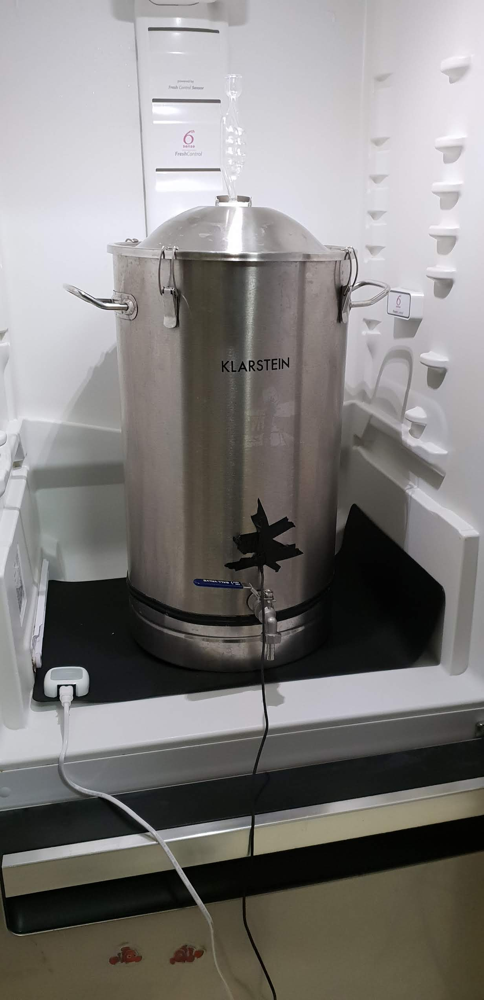
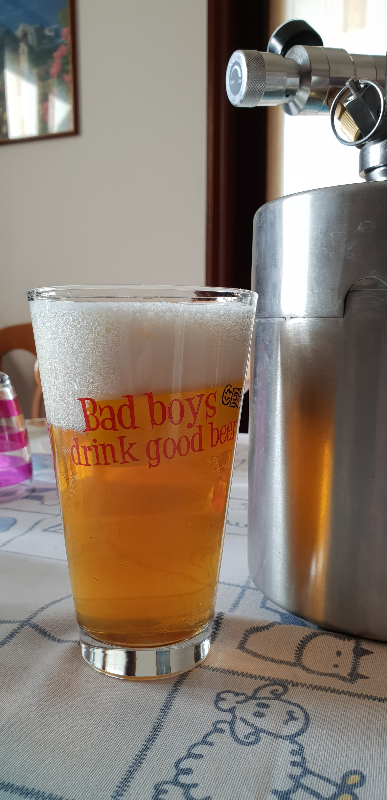

Prima cotta dell'anno 2019, proprio il primo gennaio. Pale Ale ben luppolata con luppolo autocoltivato.

## Fermentabili

| Tipologia      | Percentuale |
|----------------|-------------|
| Malto Pale     | 94%         |
| Malto Cara Red | 6%          |

## Luppoli

| Varietà                         | Tempo  | Amaro    | Quantità |
|---------------------------------|--------|----------|----------|
| Hallertau Mittelfruh            | 60 min | 23 IBU   | -        |
| Cascade/comet (autocoltivato)   | 5 min  | -        | 6,66 g/l |
| Cascade/comet (autocoltivato)   | DH     | -        | 6,66 g/l |

## Lievito

Fermentis Safale US-05

## Acqua

Per la quantità ho usato 4,8lt/kg direttamente in mash (ho preso l'all-in-one per semplificarmi la vita e lo sparge lo evito volentieri). Perché questo valore?  
Nel mio caso facevano 24 litri esatti, ossia due pacchi di confezioni d'acqua 6x2litri. Tutto per massimizzare il pragmatismo.

Siccome ogni volta è una dura lotta per abbassare il ph ho cambiato acqua preferendo una con un'alcalinità residua minore.  
La scelta è ricaduta sull'acqua Ginevra dell'eurospin, praticamente la meno cara che abbia mai usato, disponibile nelle bottiglie da 2lt e con un alcalinità residua di 81,16 contro 188,54 della San Benedetto che usavo prima.

Per abbassare il ph teorico a 5,41 ho aggiunto 3g di gypsum, 4g di cloruro di calcio e 4 ml di acido lattico.

I valori finali dell'acqua quindi sono:

| Sali            | ppm  |
|-----------------|------|
| Calcio          | 111  |
| Magnesio        | 5    |
| Sodio           | 4    |
| Cloruri         | 83   |
| Solfati         | 71   |
| Cloruri/Solfati | 1,16 |

## Assorbimento del mash

Mi sono procurato una riga in inox per poter misurare l'altezza del livello del liquido per poter recuperare poi i litri.  
Mi sono accorto subito che i 24 litri dell'acqua sono arrivati alla tacca dei 25 litri in pentola mentre la riga misurava 25,5 cm.  
Facendo un breve calcolo per trovare il volume di un cilindro (dato il diametro della pentola che è 35 cm) con quella altezza otterrei un volume di 24,52 litri.  
Quell'eccedenza potrebbe essere la forma non regolare del fondo della pentola (i rubinetti erano chiusi).

Il livello misurato del preboil era 22,5 litri che darebbero un volume di 21,11 litri.  
Siccome occorre tenere contro della contrazione termica (da 20° a 78° qui dice essere di circa 2,6%, nel mio caso partivo da 13/15 gradi ma tengo questa come riferimento) quindi bisogna toglierci anche quella quota di vapore e otteniamo circa 20,57 lt di preboil (non considero per semplicità il mosto dentro il ricircolo).  
Quei 3,43 litri sono stati assorbiti dai 5kg di grani lt/kg quindi, approssimando, ho ottenuto un assorbimento di 0,7lt/kg.  

## Efficenza dell'impianto

Diamo una breve occhiata anche all'efficienza teorica dell'ammostamento attraverso questa formula:

| Misura         | Valore   |
|----------------|----------|
| OG preboil     | 50 gu    |
| Pot. pale      | 30,88 gu |
| Peso pale      | 4,7 gu   |
| Pot. carared   | 28 gu    |
| Peso carared   | 0,3 kg   |
| Efficenza mash | 67%      |

L'efficienza così bassa può essere dovuto al malto aperto già da un anno (seppur conservato bene), all'assenza di sparge e al ph un po' troppo alto.  
In ogni caso per me non è un problema visto che mi ritrovo fin troppe materie prime (per fortuna molti grani scadono nel 2020 inoltrato).

## Fermentazione

Sono partito a 18 gradi per tre giorni, 20 per altri tre giorni, 22 per 4 giorni insieme al dryhopping e poi winterizzazione di una settimana.

Qua un log documentato grazie al tilt, un comodo aggeggio per monitorare la densità durante la fermentazione.

| Data e ora       | Densità |
|------------------|---------|
| 01/01/2019 20:00 | 1056    |
| 02/01/2019 23:11 | 1045    |
| 03/01/2019 23:08 | 1035    |
| 04/01/2019 23:02 | 1021    |
| 05/01/2019 19:10 | 1013    |
| 06/01/2019 22:04 | 1009    |

Il lievito si è quindi mangiato circa 10 punti di densità i primi giorni per poi rallentare alla fine e assestarsi sul 1009.

## Dry Hopping

Il dry hopping è avvenuto con 100g di comet.  
Ho proceduto a bollire in acqua la hop bag insieme a un peso in inox (un raccordo T) e ho sanitizzato il luppolo con [questo metodo](https://www.lab4beer.it/2018/10/30/contaminazione-materie-prime-luppolo/?fbclid=IwAR22wmc33G9XKc3YYb3DtGp1MCuRtOz5HWNbUb95sC1Svjwkj4fg6blILYU) per essere più sicuro contro eventuali contaminanti sopravvissuti in freezer.

Nonostante il peso in inox la sacca galleggiava sul mosto, solo al momento dell'imbottigliamento ho visto che era scesa fino a oltre metà.  
100 grammi di fiori occupano veramente tanto volume, quanto vorrei poter pellettizzarli per conservarli in poco spazio, rendere più agevole l'utilizzo e diminuire l'assorbimento di mosto. Il ph finale si è attestato a 4,8.

## Imbottigliamento

Ho staccato il frigor qualche giorno prima di imbottigliare, il 22 gennaio.  
Ho imbottigliato due fustini da 2 litri e 9 bottiglie da 75 litri per un totale di 10,75 litri a fronte di circa 15 litri in fermentatore.  
Come già successo nella golden ale del 2018 il dryhopping ha assorbito come una spugna.

Non ho fatto travasi, non ho usato filtri e ho imbottigliato direttamente dal rubinetto col un tubo crystal e l'asta.  
Da tempo non uso più l'enolmatic che richiede più tempo per la pulizia che quello che ci mette ad imbottigliare, per un litraggio maggiore il discorso ovviamente cambierebbe.

Il lievito si è compattato bene sul fondo lasciando qualche litro sotto al rubinetto.  
Solo all'apertura di quest'ultimo ho notato per un istante del mosto più torbido.  
Il tilt e la hop back non hanno smosso il lievito quando hanno toccato il fondo e anche le ultime bottiglie sono rimaste limpide.

## Impressioni

Il primo assaggio è avvenuto domenica 3 febbraio, spillando dal primo fusto.  
La birra è limpida, solo leggermente più velata della vienna ale del 2018 mentre il colore è più carico e tendente all'arancio.

Dalle foto è molto simile alle due fatte con lo stesso grist, solo la belgian ale mi sembra leggermente più chiara, ma può dipendere dalla foto.  
Quando spillo la schiuma è sempre un po' troppo abbondante costringendomi ad aspettare un po' e la birra rimane un po' sottocarbonata.  
Probabilmente dovrei prendere uno spillatore con riduttore di pressione.

*No, non ho rotto la fisica con questa schiuma. Sotto la scritta sul bicchiere c'è un'etichetta dello stesso colore della birra. Stavo impazzendo per capirlo...* 😅

In bocca corpo medio-basso, ottimo aroma luppolato sul fruttato e lieve tropicale, non così intenso come gli esempi commerciali di alto livello (penso a quelle di crak o hammer).  
Il comet si conferma uno dei migliori luppoli del mio "luppoleto" insieme al chinook. Queste sono due varietà che consiglierei a chiunque decida di coltivarlo. Specialmente perché ha una resa assurda, si espanderà come un mostro dalle foglie chiare.

Per il futuro dovrei solo trovare il modo per rendere ancora più esplosivo l'aroma (DDH? qualche sistema di ricircolo?) e aumentare il priming (ma prima devo anche valutare una versione in bottiglia).  
Il sogno ultimo è ovviamente arrivare a carbonare in unitank, quasi obbligatorio per raggiungere gli standard dei (migliori) birrifici artigianali. La scimmia del fermentasaurus prima o poi sarà incontenibile 🙈
