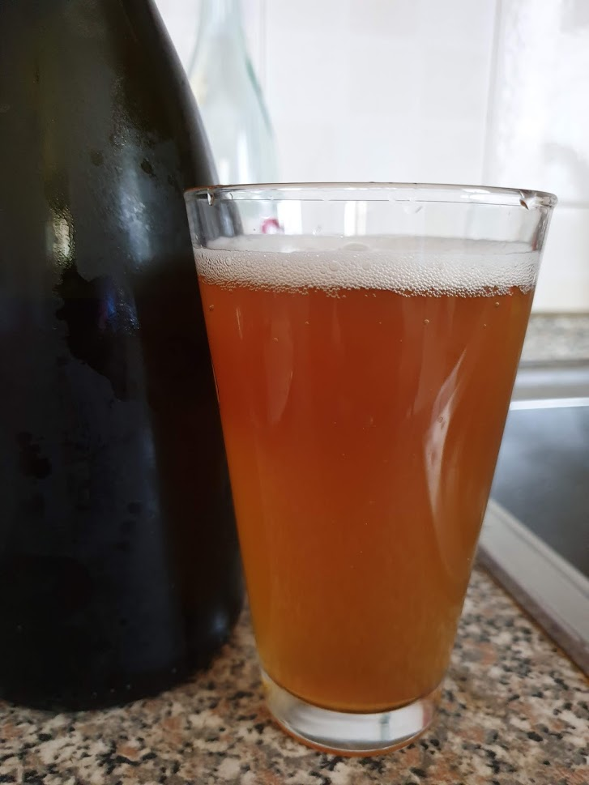

American Wheat Rye ancora col lievito kveik hornindal (secondo riciclo).

### Fermentabili
| Tipologia        | Percentuale |
|------------------|-------------|
| Malto Pilsner    | 40%         |
| Malto Rye        | 20%         |
| Malto Wheat      | 20%         |
| Malto Wheat Dark | 20%         |

### Luppoli
| Varietà | Tempo  | Amaro   | Quantità |
|---------|--------|---------|----------|
| Comet   | 60 min | 30 IBU  | -        |

### Assaggio
Non ho conservato molte informazioni di questa birra, perché era il minimo sindacale per essere considerata bevibile. 

Il suo difetto più grave è forse la bassa carbonazione, probabilmente non dovuto alla dose di priming (non meno delle altre) ma in quanto il lievito kveik si è compattato troppo sul fondo del fermentatore durante il cold crashing e quel poco che è finito in bottiglia ha lavorato male in rifermentazione.

Potrebbe anche essere stata la non ideale gestione del lievito, specie essendo un kveik andrebbe pescato dall'alto e non reinoculato lo slurry.

L'aspetto è velato, forse per la segale (chill haze?) e la schiuma è evanescente.  
Ha tutto sommato un buon aroma fruttato tipico del ceppo di lievito ma pecca di troppa dolcezza residua (aveva attenuato abbastanza poco, da 1048 a 1016).

Durante gli ultimi assaggi è leggermente migliorata, in particolare è emersa quella nota speziata che attribuirei alla segale e che in passato ho sempre scambiato per esteri del lievito belga (come scrissi [qua](/rog)).

