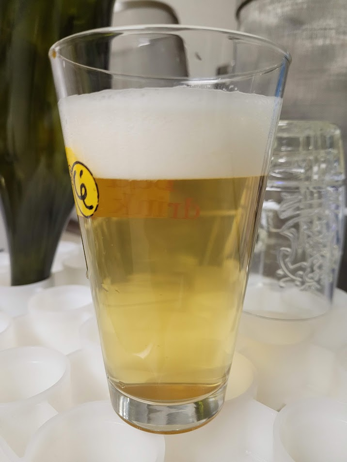

Altra blanche, prodotta il 05/12/2020

## Fermentabili

| Tipologia           | Quantità |
| ------------------- | -------- |
| Malto Pilsner       | 2500g    |
| Malto Wheat         | 1000g    |
| Fiocchi di frumento | 1000g    |

## Luppoli

| Varietà                          | Tempo  | IBU |
| -------------------------------- | ------ | --- |
| Hallertauer Hersbrucker (AA 2.5) | 60 min | 9.5 |
| Hallertauer Hersbrucker (AA 2.5) | 20 min | 8.6 |

## Spezie

A pochi minuti dalla fine ho messo coriandolo e buccia d'arancia dolce.

## Fermentazione

### Brewbucket (circa 10L)

- Mangrove M21 Wit
- Infustato 3,6L + 2L + 2L in piccoli fustini

### Dama di vetro (circa 4,5L)

- Bioferm Aromatic (S. cerevisiae)
- Aggiunta di 100g di miele d'acacia in fermentazione tumultuosa

## Considerazioni finali

La birra non si schiodò come da tradizione dai 1018 punti di densità finale. Tuttavia si rilevò la solita birra beverina e apprezzabile.

La versione con miele aveva un sapore sidroso e non fu memorabile.

