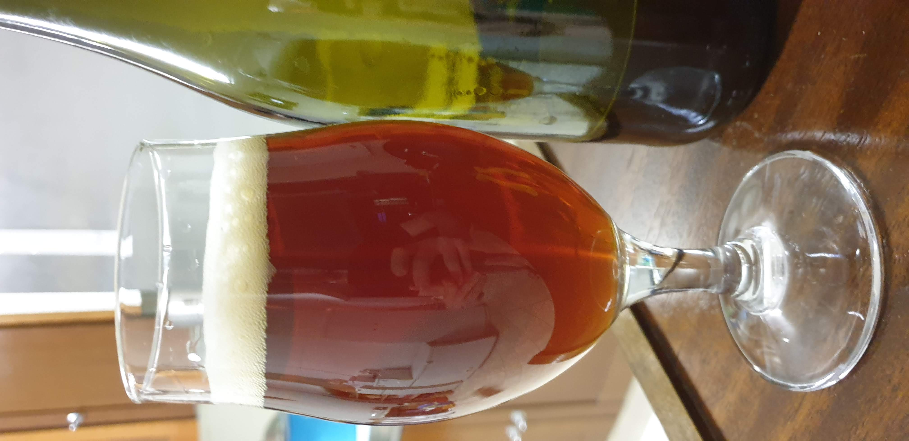

La prima birra prodotta durante il lockdown è stata una pseudo belgian strong dark ale che venne con una gradazione intorno agli 8° quindi forse più territorio delle dubbel pesanti che le vere bsda.

L'unica cosa che ho cambiato rispetto al solito è stata l'acqua, ossia quella del mio pozzo bollita per ridurre il calcare. Essendo stata prodotta durante il primo lockdown del 2020 non sono voluto andare al supermercato a fare scorta di molte bottiglie d'acqua e ho sfruttato la vecchia pentola e il fornellone a gas.  
Ho raffreddato con la serpentina in controflusso portando direttamente l'acqua nella pentola elettrica, senza il cestello dei grani. Non so se questo ha impattato sulla decalcificazione, visto che andrebbe fatta raffreddare lentamente in modo da far depositare il residuo fisso che si è separato tramite la bollitura (o forse con un whirlpool).  
In ogni caso la pentola dopo il trasferimento si presentava con la classica patina bianca quindi un po' di effetto l'ha avuto.

### Fermentabili
| Tipologia          | Percentuale |
|--------------------|-------------|
| Malto Vienna       | 5 kg        |
| Malto Carabohemian | 0,5 kg      |
| Malto Caramonaco2  | 0,5 kg      |
| Estratto secco     | 0,5 kg      |

### Luppoli
Non ricordo i luppoli utilizzati ma fu un unica gettata a 60° di un luppolo da amaro in pellet per raggiungere gli IBU dello stile.

### Lievito
Fermentis T-58 (due bustine)

### Assaggio
La birra venne discretamente bene e il lievito T-58 donò i tipici esteri speziati di questo tipo di birre belghe. Forse un po' monocorde e con poca personalità. Forse troppo abbondante l'utilizzo di malti speciali, specie il carabohemian che ha tirato fuori un carattere simile alla prossima birra descritta, che mi ricordava un po' la crosta di pane molto tostata anche se rispetto alla pale ale si abbina meglio al tipo di birra.

