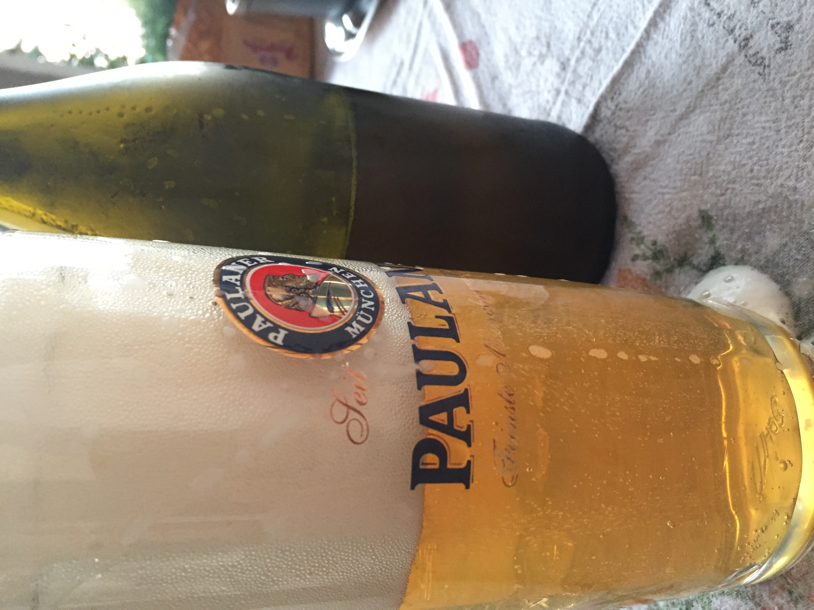
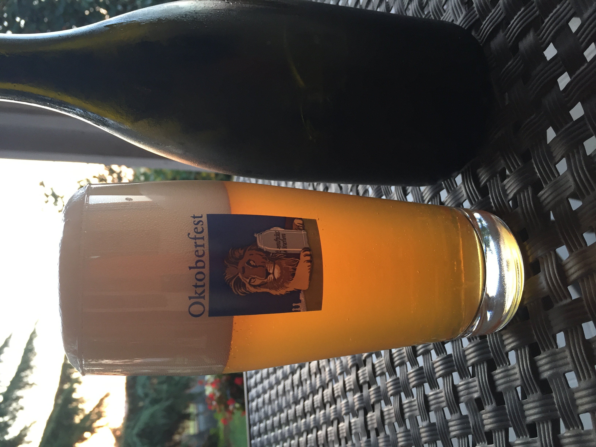

Una delle birre migliori del 2020 è sicuramente questa kolsch che è durata poco nei giorni estivi.

## Fermentabili

| Tipologia      | Percentuale |
|----------------|-------------|
| Malto Vienna   | 5,4 kg      |
| Malto Carahell | 0,6 kg      |

## Luppoli

Un solo luppolo d'amaro per raggiungere gli ibu dello stile.

## Lievito

Fermentis safale K-97

## Fermentazione

1047 -> 1011

