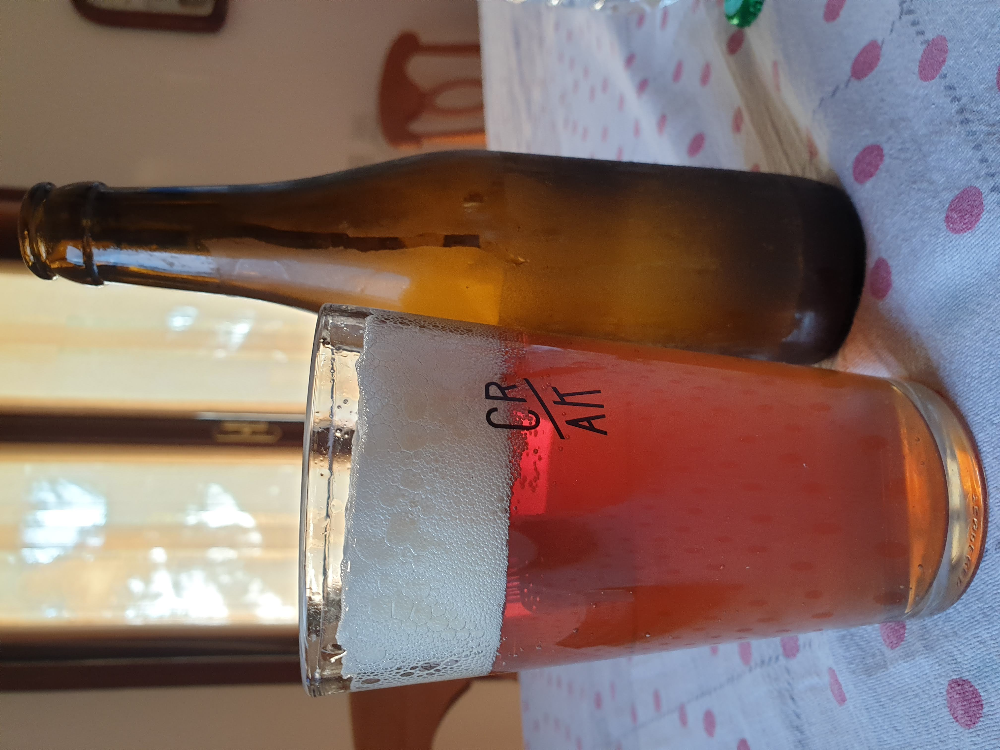

Ho voluto rifare la classica pale ale ma anziché il consueto 6% di carared ho messo il carabohemian, decisamente più scuro. 

### Fermentabili
| Tipologia          | Percentuale |
|--------------------|-------------|
| Malto Vienna       | 5,7 kg      |
| Malto Carabohemian | 0,3 kg      |

### Luppoli
Solito mix di luppoli autocoltivati, prevalentemente comet. Le dosi sono state a salire del tipo 10g a 60', 20g a 20', 30g a 5' e una cinquantina di grammi in dry-hopping. 
Ho visto che è controproducente utilizzare troppo luppolo in dh in quanto essendo molto voluminoso tende ad ammucchiarsi senza poter immergersi completamente.

### Lievito
US-05

### Assaggio
La birra fu piacevole all'inizio ma passando il tempo ha via via fatto emergere una nota fastidiosa, difficile da descrivere, come di odore di plastiche di componenti elettronici. Non so se attribuirla al carabohemian o al luppolo perché dubito errori grossolani dovuti alla fermentazione che è sempre avvenuta sotto i 20° con una giusta dose di US-05. Di sicuro non userò più questo malto da solo per questo tipo di birre, penso ci sia un contrasto troppo elevato tra il malto base e questo e andrebbe "livellato" con almeno un altro malto speciale come il caramonaco, come ho fatto nella precedente.

L'aroma di luppolo è svanito dopo poco tempo ed è rimasta la componente maltata anche se sgraziata da questo difetto. Carbonazione forse un po' troppo spinta.

