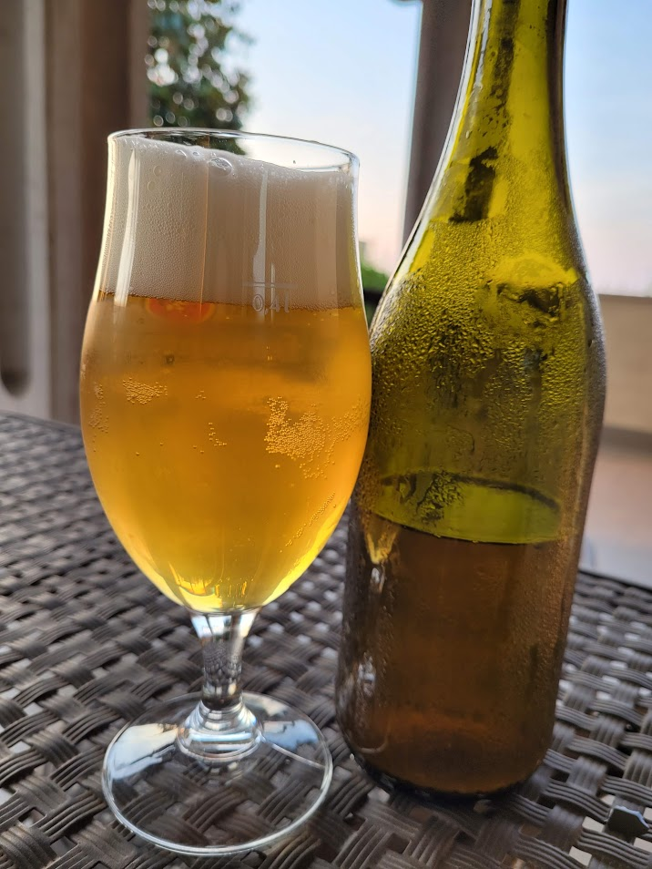

La prima birra col braumeister è stata una birra difficilmente categorizzabile: base blanche (60% vienna e 40% fiocchi di frumento), luppolatura casuale con luppolo autocoltivato e lievito voss.

Il più grosso fail è stato commesso in fase di imbottigliamento in quanto la birra avendo lavorato a temperature alte (oltre 30°), dopo un crash cooling, l'alta flocculazione del lievito e imbottigliamento dall'alto (con l'asta da travaso dell'enolmatic) ho probabilmente portato in bottiglia troppo poco lievito e poco attivo che non ha voluto sapere di rifermentare adeguatamente alle temperature di cantina, sebbene estive, di circa 24°.

La birra si presenta quindi con poca schiuma grossolana che svanisce presto, carbonazione bassa (non è proprio piatta ma poco ci manca) e dolce. Un peccato perché per il resto la reputo valida, il lievito ha portato un bell'aroma che ricorda gli agrumi e la vaniglia il che si sposano anche bene con la (non voluta) dolcezza residua. Però mi fa troppo strano bere birra quasi non carbonata e sta rimanendo sugli scaffali.

Paradossalmente può essere non troppo distante dalle vere birre di fattoria del nord europa, da dove viene questo ceppo di lievito, che vengono bevute tradizionalmente "sgasate".

Sicuramente sarà d'obbligo con questo ceppo utilizzare un lievito da rifermentazione oppure operare in isobarico.

Dopo alcuni mesi la birra, lasciata fuori dal frigo, ha ripreso a carbonare e le ultime bottiglie hanno raggiunto un giusto livello di carbonazione. Si riconferma il piacevole aroma agrumato con qualche parvenza di vaniglia. L'amaro è basso, non ho ancora sentito i difetti dovuti dall'ossidazione. Un po' anonima se bevuta da sola, ha il suo perché accompagnata da una pizza.

