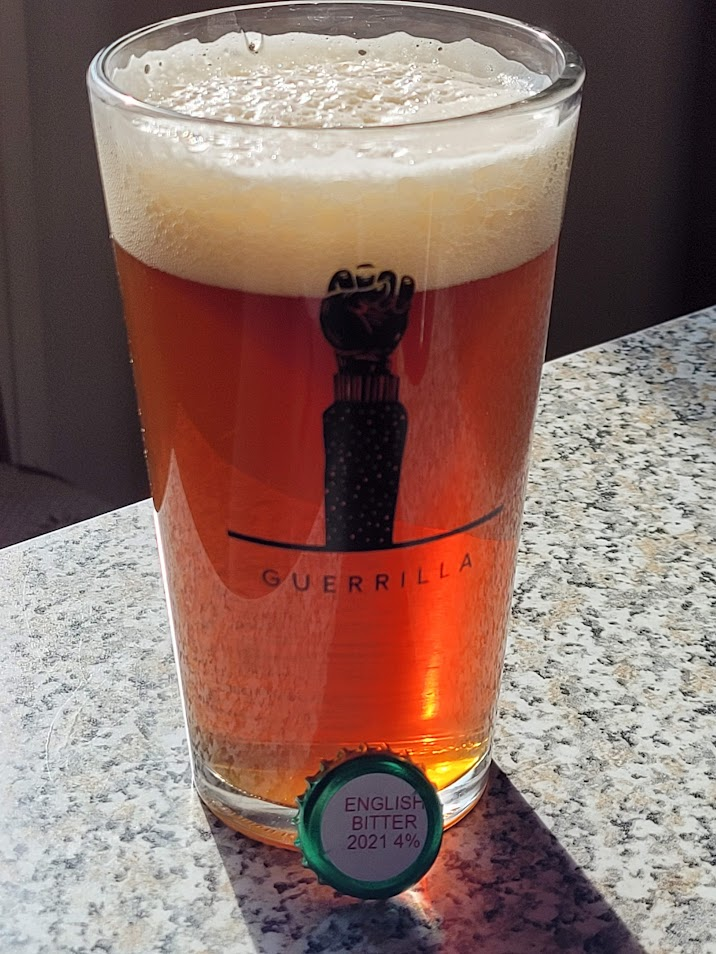

Best bitter prodotta il 13/02/2021

## Dati Generali

| Parametro             | Valore |
| --------------------- | ------ |
| lt mash               | 25.2   |
| lt sparge             | 2.1    |
| Litri in pentola      | 23     |
| OG preboil            | 1034   |
| Min bollitura         | 60     |
| Litri in fermentatore | 18     |
| Efficienza            | 65 %   |
| OG                    | 1046   |
| ABV                   | 4.6 %  |
| Plato                 | 11.5   |
| IBU                   | 36.7   |
| BU/GU                 | 0.8    |

## Malti e Fermentabili

| Ingrediente | Tipo  | Quantità | Percentuale |
| ----------- | ----- | -------- | ----------- |
| Pale        | Grani | 3500 gr  | 83 %        |
| Carahell    | Grani | 500 gr   | 12 %        |
| Crystal 80L | Grani | 200 gr   | 5 %         |
| **Totale**  |       | 4200 gr  |             |

## Luppoli

| Luppolo                      | Tempo  | Tipo   | IBU  |
| ---------------------------- | ------ | ------ | ---- |
| Fuggle (AA 4.5)              | 60 min | Pellet | 9.0  |
| Goldings, East Kent (AA 4.5) | 60 min | Pellet | 9.0  |
| Goldings, East Kent (AA 4.5) | 30 min | Pellet | 6.9  |
| Fuggle (AA 4.5)              | 30 min | Pellet | 6.9  |
| Goldings, East Kent (AA 4.5) | 5 min  | Plug   | 2.4  |
| Fuggle (AA 4.5)              | 5 min  | Pellet | 2.4  |
| **Totale**                   |        |        | 36.7 |

## Lieviti

Fermentis S-04

## Profilo Mash

| Descrizione | Temperatura | Tempo |
| ----------- | ----------- | ----- |
| Mash In     | 65 °C       | 60    |
| Mash Out    | 75 °C       | 10    |

## Impressioni

Aspetto molto limpido (classica ottima flocculazione dell'S04).

Voglio azzardare a dire che questa è la migliore birra che abbia mai fatto. Nella mia mente ero in un pub inglese, e non ci sono mai stato.

