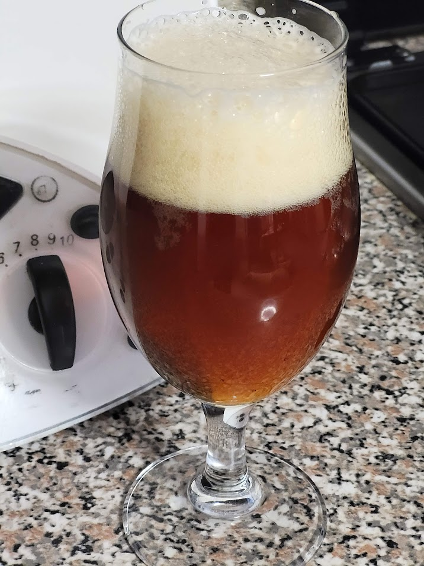

Saison al bergamotto prodotta il 24/12/2021

## Dati Principali

| **Parametro** | **Valore** |
| ------------- | ---------- |
| OG            | 1046       |
| ABV           | 4.6 %      |
| Plato         | 11.5       |
| IBU           | 25.7       |
| BU/GU         | 0.56       |

## Malti e Fermentabili

| **Ingrediente**              | **Tipo** | **Quantità** | **Percentuale** |
| ---------------------------- | -------- | ------------ | --------------- |
| Malto Pils Chateau           | Grani    | 5700 gr      | 95 %            |
| Malto Pale Crystal 250 EBC   | Grani    | 260 gr       | 4 %             |
| Malto Pale Chocolate 500 EBC | Grani    | 40 gr        | 1 %             |
| **Totale**                   |          | 6000 gr      |                 |

## Luppoli

| **Luppolo**              | **Quantità** | **Tempo** | **Forma** |
| ------------------------ | ------------ | --------- | --------- |
| Target (AA 9)            | 15 gr        | 60 min    | Pellet    |
| Willamette (AA 4)        | 20 gr        | 15 min    | Pellet    |
| Willamette (AA 4)        | 30 gr        | 5 min     | Pellet    |
| Buccia Bergamotto (AA 0) | 30 gr        | 5 min     | Plug      |
| **Totale**               | 95 gr        | 60 min    |           |

## Lievito

- Lievito secco Mangrove French Saison recuperato dalla precedente cotta

## Considerazioni

Questa ricetta risulta scarsamente documentata così come l'assaggio.

