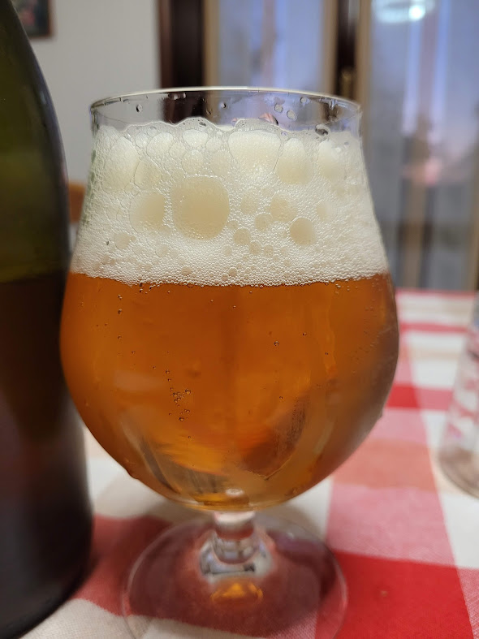

Saison prodotta il 25/04/2021

## Dati Generali

| Parametro             | Valore |
| --------------------- | ------ |
| lt mash               | 30     |
| Litri in pentola      | 25     |
| OG preboil            | 1046   |
| Min bollitura         | 60     |
| Litri in fermentatore | 22     |
| Efficienza            | 65 %   |
| OG                    | 1053   |
| ABV                   | 5.4 %  |
| Plato                 | 13.1   |
| IBU                   | 18.4   |
| BU/GU                 | 0.35   |

## Malti e Fermentabili

| Nome       | Tipo  | Quantità | Percentuale |
| ---------- | ----- | -------- | ----------- |
| Pilsner    | Grani | 5300 gr  | 88 %        |
| Carahell   | Grani | 700 gr   | 12 %        |
| **Totale** |       | 6000 gr  |             |

## Luppoli

| Nome                         | AA  | Minuti | Formato | IBU  |
| ---------------------------- | --- | ------ | ------- | ---- |
| Goldings, East Kent (AA 4.5) | 4.5 | 60 min | Pellet  | 13.8 |
| Goldings, East Kent (AA 4.5) | 4.5 | 15 min | Pellet  | 4.6  |
| Buccia Bergamotto (AA 0)     | 0   | 15 min | Pellet  | 0.0  |
| **Totale**                   |     |        |         | 18.4 |

## Profilo Mash

| Descrizione | Temperatura | Tempo |
| ----------- | ----------- | ----- |
| Mash In     | 68 °C       | 60    |
| Mash Out    | 78 °C       | 10    |

## Lievito

Fermentis BE-134

## Considerazioni

Ottima saison per i mesi estivi

