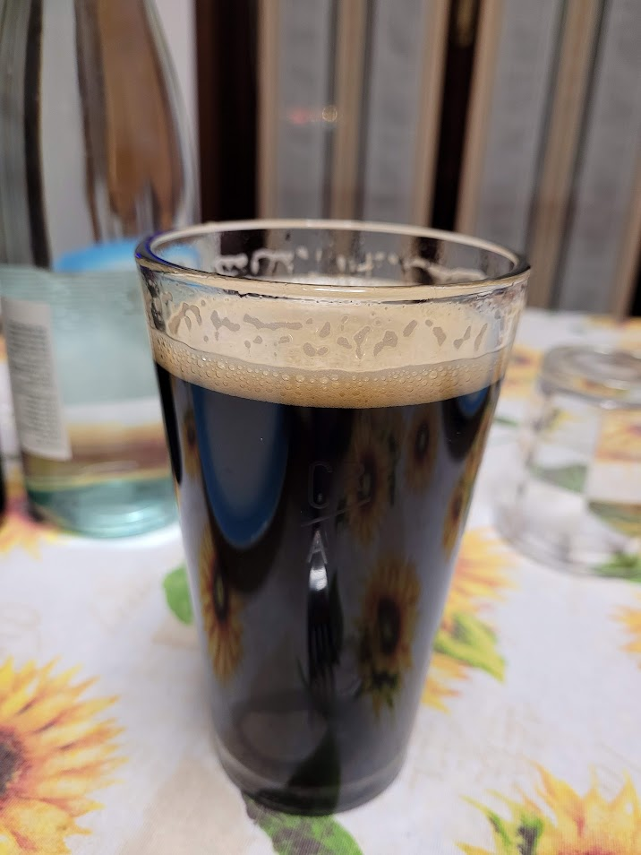

Irish Stout prodotta il 30/01/2021

## Dati Generali

| Parametro             | Valore |
| --------------------- | ------ |
| lt mash               | 25.6   |
| Litri in pentola      | 22     |
| OG preboil            | 1036   |
| Min bollitura         | 60     |
| Litri in fermentatore | 19     |
| Efficienza            | 65 %   |
| OG                    | 1042   |
| ABV                   | 4.2 %  |
| Plato                 | 10.5   |
| IBU                   | 28.9   |
| BU/GU                 | 0.69   |

## Malti e Fermentabili

| Ingrediente        | Tipo  | Quantità    | Percentuale |
| ------------------ | ----- | ----------- | ----------- |
| Viking Pilsner     | Grani | 1560 gr     | 37 %        |
| Viking Pale Ale    | Grani | 1500 gr     | 35 %        |
| Weyermann CaraHell | Grani | 600 gr      | 14 %        |
| Viking Black       | Grani | 340 gr      | 8 %         |
| Viking Chocolate   | Grani | 260 gr      | 6 %         |
| **Totale**         |       | **4260 gr** |             |

## Luppoli

| Luppolo        | Tempo  | Tipo   | IBU  |
| -------------- | ------ | ------ | ---- |
| Target (AA 11) | 60 min | Pellet | 28.9 |

## Lieviti

Fermentis S-04

## Profilo Mash

| Descrizione | Temperatura | Tempo |
| ----------- | ----------- | ----- |
| Mash      | 65 °C       | 60    |
| Mash Out    | 75 °C       | 10    |

## Impressioni

La flocculazione dell'S04 fa intravedere il color rosso scuro in controluce.

Una delle migliori stout, senza difetti di fermentazione. Forse un po' dolce vista l'attenuazione finale di 1018. Ha fatto un po' fatica a carbonare inizialmente per un mio errore, cioè metterle in ambiente troppo freddo e senza lievito da rifermentazione, cosa che ho sempre fatto da qua in avanti.

