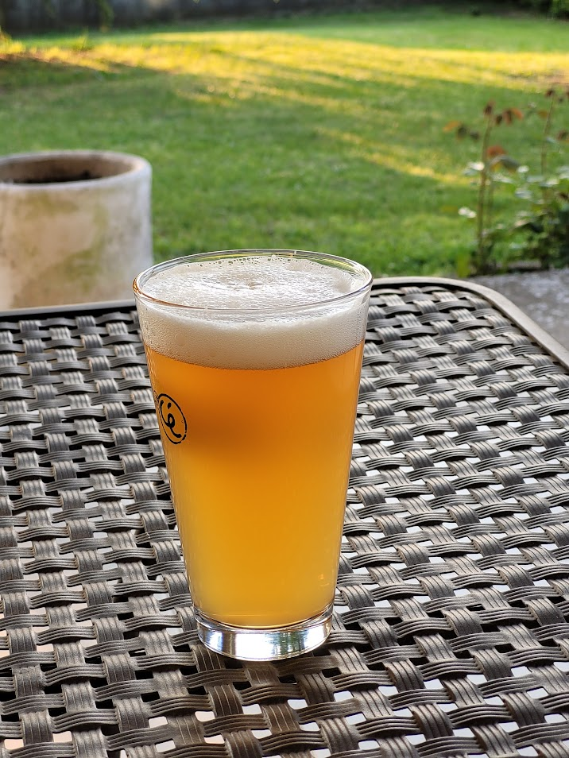

American Wheat, single hop Strata brassata il 13/03/2021

## Caratteristiche della Birra

| Parametro               | Valore   |
| ----------------------- | -------- |
| Colore della birra      | 4.4 EBC  |
| Amarezza                | 44.0 IBU |
| Gravità originale       | 11.9 °P  |
| Acqua di birrificazione | 25 litri |
| Gravità specifica       | 1.048 SG |

## Malti

| Tipo di malto | Quantità   | Colore      | Percentuale |
| ------------- | ---------- | ----------- | ----------- |
| Pilsner       | 1.75 kg    | 2 EBC       | 38.9 %      |
| Wheat         | 2.25 kg    | 2 EBC       | 50.0 %      |
| Carahell      | 0.5 kg     | 24 EBC      | 11.1 %      |
| **Totale**    | **4.5 kg** | **4.4 EBC** |             |

## Mash

| Fase di riposo | Temperatura | Durata |
| -------------- | ----------- | ------ |
| Protein rest   | 52 °C       | 15 min |
| Mash           | 65 °C       | 60 min |
| Mash Out       | 78 °C       | 10 min |

## Luppolo

| Tipo di luppolo | AA   | Tempo prima della fine | Quantità |
| --------------- | ---- | ---------------------- | -------- |
| Strata          | 15 % | 60 min                 | 22.1 IBU |
| Strata          | 15 % | 15 min                 | 21.9 IBU |
| Strata          | 15 % | 0 min                  | 0.0 IBU  |
| Strata          | 15 % | Dry Hop                | 2 gr/lt  |

## Considerazioni

La birra è stata infustata e spillata, quindi consumata in relativamente breve tempo. I danni dell'ossidazione dall'assenza di contropressione (se non un piccolo vuoto fatto dall'enolmatic durante i trasferimenti) non si sono fatti troppo sentire in una birra discretamente luppolata come questa.

