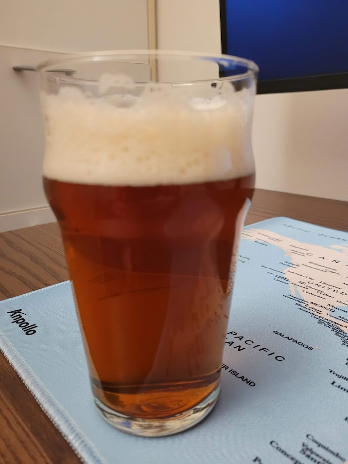

Best Bitter brassata un giorno di marzo 2022

## Volume

| Volume della Cotta | Volume Pre-Bollitura |
| ------------------ | -------------------- |
| 23 L               | 25.5 L               |

## Efficienza di Ammostamento

65%

## Densità e Alcol

| OG    | FG    | ABV   |
| ----- | ----- | ----- |
| 1.040 | 1.011 | 4.67% |
| 1.048 | 1.012 | 4.58% |
| 1.045 |       |       |

## Colore e Amaro

| EBC  | IBU | BU/GU |
| ---- | --- | ----- |
| 21.5 | 31  | 0.69  |
| 15.8 | 25  | 0.57  |
| 11.5 | 40  | 0.91  |

## Fermentabili (5 kg)

| Ingrediente                     | Quantità | EBC |
| ------------------------------- | -------- | --- |
| Pale Ale Dingemans              | 4.7 kg   | 6.5 |
| Crystal Malt 60L Thomas Fawcett | 264 g    | 159 |
| Pale Chocolate Thomas Fawcett   |          | 600 |

## Luppoli (85 g)

| Luppolo                  | Quantità | %AA | IBU  | Tempo Bollitura |
| ------------------------ | -------- | --- | ---- | --------------- |
| Target                   | 15 g     | 9.0 | 16.8 | 60 min          |
| East Kent Goldings (EKG) | 30 g     | 5.0 | 9.2  | 15 min          |
| East Kent Goldings (EKG) | 40 g     | 5.0 | 5    | 5 min           |
| Totale                   | 85 g     |     | 31   |                 |

## BU/GU

0.69

## Gravità

| Gravità Pre-Bollitura | Gravità Iniziale | Gravità Finale Stimata |
| --------------------- | ---------------- | ---------------------- |
| 1.041                 | 1.045            | 1.011                  |

## Colore

21.5 EBC

## Lievito

1 pac. Lallemand (LalBrew) Windsor Yeast

## Profilo di Ammostamento (High fermentability)

| Temperatura | Tempo  |
| ----------- | ------ |
| 65 ℃        | 60 min |

## Profilo di Fermentazione (Ale)

| Fase     | Temperatura | Durata    |
| -------- | ----------- | --------- |
| Primaria | 20 ℃       | 14 giorni |

## Carbonazione

| Volumi di CO2 |
| ------------- |
| 2.4           |

## Acqua

| Tipo di Acqua          | Quantità |
| ---------------------- | -------- |
| Acqua di Ammostamento  | 28.48 L  |
| Acqua Totale           | 28.48 L  |
| Volume di Ammostamento | 31.83 L  |

## pH

5.78

## Considerazioni

Una buona birra ma lievemente penalizzata da un difetto di fermentazione, una lieve nota di acido butirrico.

