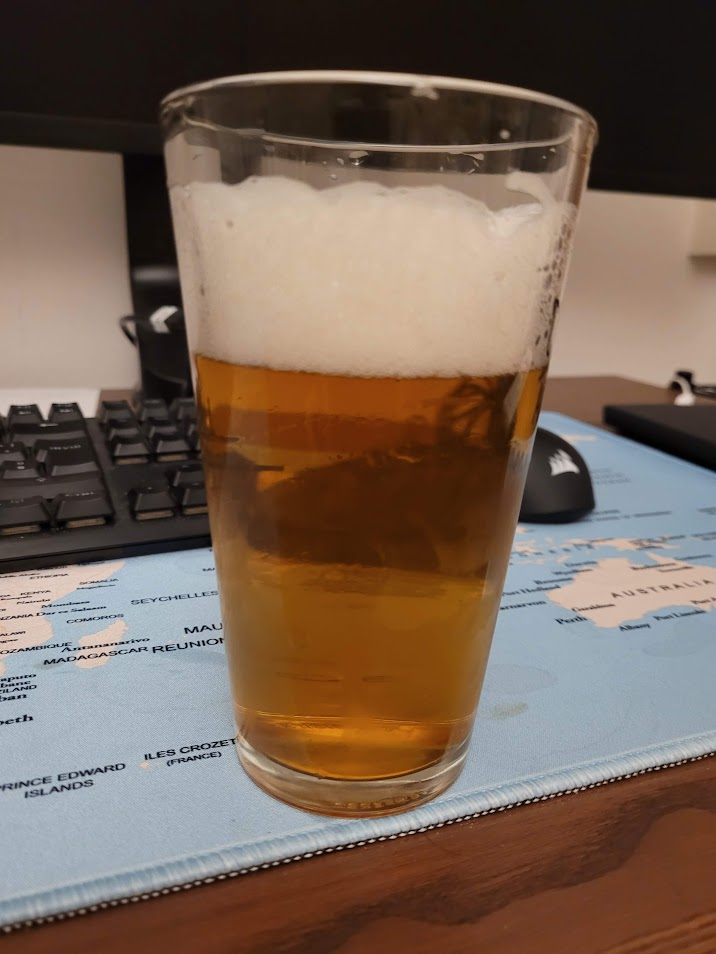

Blonde ale brassata l'8 maggio 2022

## Volume

| Volume della Cotta | Volume Pre-Bollitura |
| ------------------ | -------------------- |
| 23 L               | 27.5 L               |

## Efficienza

| Efficienza del birrificio | Efficienza di Ammostamento |
| ------------------------- | -------------------------- |
| 65%                       | 67.8%                      |

## Densità e Alcol

| OG    | FG    | ABV  |
| ----- | ----- | ---- |
| 1.038 | 1.008 | 5.0% |
| 1.046 | 1.012 |      |

## Colore e Amaro

| EBC | IBU | BU/GU |
| --- | --- | ----- |
| 8.3 | 33  | 0.71  |
| 45  |     | 0.99  |

## Fermentabili (5 kg)

| Ingrediente             | Quantità | EBC |
| ----------------------- | -------- | --- |
| Maris Otter Paul's Malt | 5 kg     | 5   |
| Sugar, Table (Sucrose)  | 200 g    | 2   |

## Luppoli (160 g)

| Luppolo                  | Quantità | %AA  | IBU | Tempo Bollitura |
| ------------------------ | -------- | ---- | --- | --------------- |
| East Kent Goldings (EKG) | 5 g      | 5.0  | 2.9 | 60 min          |
| Sabro                    | 5 g      | 15.0 | 8.7 | 60 min          |
| East Kent Goldings (EKG) | 10 g     | 5.0  | 2.9 | 15 min          |
| Sabro                    | 10 g     | 15.0 | 8.7 | 15 min          |
| East Kent Goldings (EKG) | 20 g     | 5.0  | 2.3 | 15 min          |
| Sabro                    | 20 g     | 15.0 | 7   | 5 min           |
| East Kent Goldings (EKG) | 25 g     | 5.0  |     | 5 min           |
| Sabro                    | 25 g     | 15.0 |     | 5 min           |
| East Kent Goldings (EKG) | 20 g     | 5.0  |     | 0 min           |
| Sabro                    | 20 g     | 15.0 |     | 0 min           |
| Totale                   | 160 g    |      | 33  |                 |

## Dry Hops

| Luppolo                  | Quantità | %AA  | Tempo Dry Hop |
| ------------------------ | -------- | ---- | ------------- |
| East Kent Goldings (EKG) | 20 g     | 5.0  | 0 giorni      |
| Sabro                    | 20 g     | 15.0 | 0 giorni      |

## BU/GU

0.71

## Gravità

| Gravità Pre-Bollitura | Gravità Iniziale | Gravità Totale | Gravità Finale Stimata |
| --------------------- | ---------------- | -------------- | ---------------------- |
| 1.039                 | 1.042            | 1.046          | 1.008                  |

## Colore

8.3 EBC

## Lievito

1 pacch Lallemand (LalBrew) BRY-97 80% American West Coast Ale

## Profilo di Ammostamento (High fermentability)

| Temperatura | Tempo  |
| ----------- | ------ |
| 65 ℃       | 60 min |

## Profilo di Fermentazione (Ale)

| Fase     | Temperatura | Durata    |
| -------- | ----------- | --------- |
| Primaria | 20 ℃       | 14 giorni |

## Carbonazione

| Volumi di CO2 |
| ------------- |
| 2.4           |

## Acqua

| Tipo di Acqua          | Quantità |
| ---------------------- | -------- |
| Acqua di Ammostamento  | 30.4 L   |
| Acqua Totale           | 30.4 L   |
| Volume di Ammostamento | 33.75 L  |

## pH

5.90

## Considerazioni

Buona golden ale per i mesi estivi

