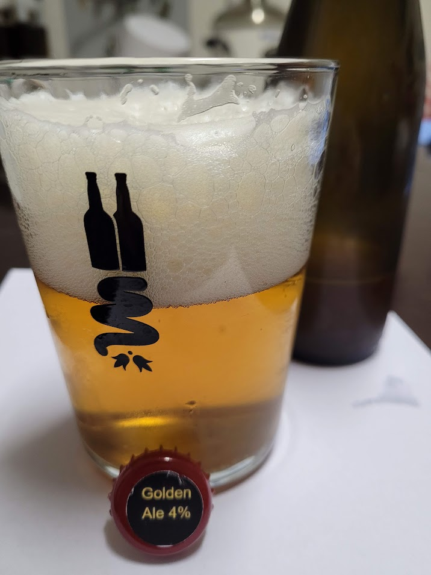

Golden Ale brassata il 01/11/2022

## Densità e Alcol

| OG    | FG    | ABV  |
| ----- | ----- | ---- |
| 1.038 | 1.006 | 5.0% |
| 1.053 | 1.012 |      |
| 1.046 | 1.012 |      |

## Volume

| Volume della Cotta | Volume Pre-Bollitura |
| ------------------ | -------------------- |
| 23 L               | 27.5 L               |

## Efficienza

| Efficienza del birrificio | Efficienza di Ammostamento |
| ------------------------- | -------------------------- |
| 65%                       | 67.8%                      |

## Colore e Amaro

| EBC | IBU | BU/GU |
| --- | --- | ----- |
| 8.3 | 27  | 0.58  |
| 9.9 | 45  | 0.44  |

## Fermentabili (5 kg)

| Ingrediente             | Quantità | EBC |
| ----------------------- | -------- | --- |
| Maris Otter Paul's Malt | 5 kg     | 5   |
| Sugar, Table (Sucrose)  | 200 g    | 2   |

## Luppoli (100 g)

| Luppolo                  | Quantità | %AA | IBU  | Tempo Bollitura |
| ------------------------ | -------- | --- | ---- | --------------- |
| Target                   | 20 g     | 7.4 | 17.2 | 60 min          |
| East Kent Goldings (EKG) | 20 g     | 5.0 | 5.8  | 15 min          |
| East Kent Goldings (EKG) | 30 g     | 5.0 | 3.5  | 5 min           |
| East Kent Goldings (EKG) | 30 g     | 5.0 |      | 0 min           |
| Totale                   | 100g     |     | 27   |                 |

## BU/GU

0.58

## Gravità

| Gravità Pre-Bollitura | Gravità Iniziale | Gravità Totale | Gravità Finale Stimata |
| --------------------- | ---------------- | -------------- | ---------------------- |
| 1.039                 | 1.042            | 1.046          | 1.012                  |

## Colore

8.3 EBC

## Lievito

1 pacch. Fermentis S-33 70% SafBrew Ale

## Profilo di Ammostamento (High fermentability)

| Temperatura | Tempo  |
| ----------- | ------ |
| 65 ℃        | 60 min |

## Profilo di Fermentazione (Ale)

| Fase     | Temperatura | Durata    |
| -------- | ----------- | --------- |
| Primaria | 20 ℃        | 14 giorni |

## Carbonazione

| Volumi di CO2 |
| ------------- |
| 2.4           |

## Acqua

| Tipo di Acqua          | Quantità |
| ---------------------- | -------- |
| Acqua di Ammostamento  | 30.4 L   |
| Acqua Totale           | 30.4 L   |
| Volume di Ammostamento | 33.75 L  |

## pH

PH arrivato a 5,7 con circa 14 ml di lattico su 30 litri

## Considerazioni finali

Ottima golden ale

