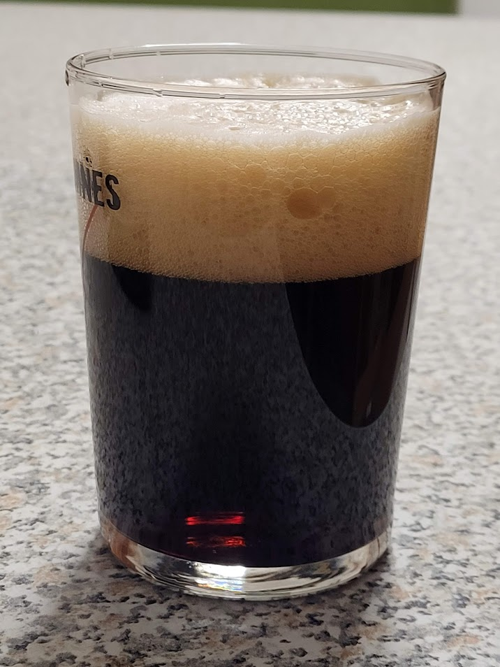

English Porter brassata il 15/10/2022

## Densità e Alcol

| OG    | FG    | ABV  |
| ----- | ----- | ---- |
| 1.040 | 1.008 | 4.5% |
| 1.045 | 1.011 |      |
|       | 1.014 |      |

## Volume

| Volume della Cotta | Volume Pre-Bollitura |
| ------------------ | -------------------- |
| 23 L               | 27.5 L               |

## Efficienza

| Efficienza del birrificio | Efficienza di Ammostamento |
| ------------------------- | -------------------------- |
| 65%                       | 67.8%                      |

## Colore e Amaro

| EBC | IBU |
| --- | --- |
| 63  | 21  |

## Fermentabili (5.2 kg)

| Ingrediente                      | Quantità | EBC  |
| -------------------------------- | -------- | ---- |
| Pale Ale Dingemans               | 4.485 kg | 6.5  |
| Dark Crystal Malt Thomas Fawcett | 305 g    | 220  |
| Pale Chocolate Thomas Fawcett    | 210 g    | 600  |
| Roast Barley Crisp               | 200 g    | 1375 |

## Luppoli (40 g)

| Luppolo | Quantità | %AA | IBU  | Tempo Bollitura |
| ------- | -------- | --- | ---- | --------------- |
| Target  | 10 g     | 9.0 | 10.3 | 60 min          |
| Target  | 15 g     | 9.0 | 7.7  | 15 min          |
| Target  | 15 g     | 9.0 | 3.1  | 5 min           |
| Totale  | 40g      |     | 21.1 |                 |

## BU/GU

0.47

## Gravità

| Gravità Pre-Bollitura | Gravità Iniziale | Gravità Finale Stimata |
| --------------------- | ---------------- | ---------------------- |
| 1.041                 | 1.045            | 1.011                  |

## Colore

63 EBC

## Lievito

1 pac. Lallemand (LalBrew) Windsor Yeast

## Profilo di Ammostamento (High fermentability)

| Temperatura | Tempo  |
| ----------- | ------ |
| 65 ℃        | 60 min |

## Profilo di Fermentazione (Ale)

| Fase     | Temperatura | Durata    |
| -------- | ----------- | --------- |
| Primaria | 20 ℃        | 14 giorni |

## Carbonazione

| Volumi di CO2 |
| ------------- |
| 2.4           |

## Acqua

| Tipo di Acqua          | Quantità |
| ---------------------- | -------- |
| Acqua di Ammostamento  | 30.56 L  |
| Acqua Totale           | 30.56 L  |
| Volume di Ammostamento | 34.04 L  |

## pH

5.65

## Considerazioni finali

Buona porter, secca e amara ma con un po' di caramellato a supporto.

