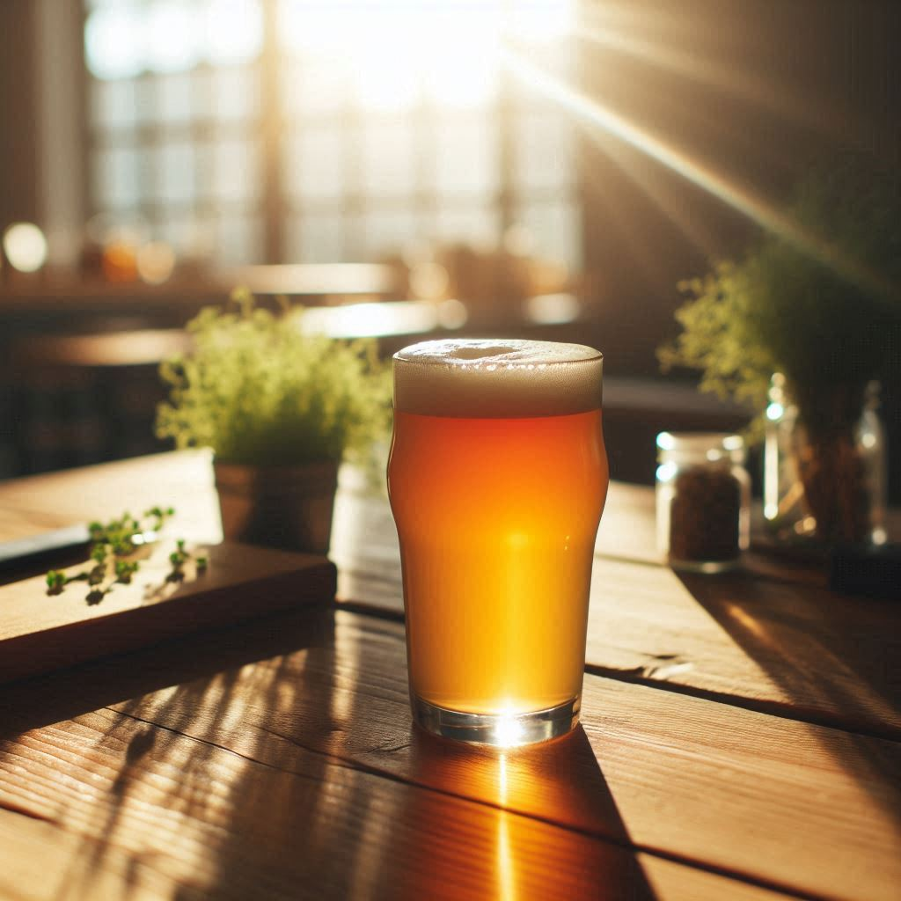

American pale ale con simcoe

## Malti e Fermentabili

| Ingrediente | Quantità |
| ----------- | -------- |
| Maris Otter | 5 kg     |

## Acqua

| Descrizione | Quantità | Note                            |
| ----------- | -------- | ------------------------------- |
| Acqua       | 25 L     | pH 5,7 (12 ml di acido lattico) |

## Luppoli

| Luppolo | Quantità | Tempo                 | Tipo   |
| ------- | -------- | --------------------- | ------ |
| Simcoe  | 20 g     | 60 min                | Pellet |
| Simcoe  | 30 g     | 0 min                 | Pellet |
| Simcoe  | 40 g     | Dry-Hop dopo 3 giorni | Pellet |

## Lieviti

| Lievito                 | Quantità | Note |
| ----------------------- | -------- | ---- |
| Belle Saison Beer Yeast | 1 pacch  |      |

## Processo

| Descrizione             | Valore                        |
| ----------------------- | ----------------------------- |
| Volume nel fermentatore | Poco più di 18 L              |
| OG                      | 1.060                         |
| FG                      | 1.012                         |
| ABV                     | 6.31% (senza rifermentazione) |
| pH fine fermentazione   | 4,4                           |
| Winterizzazione         | 5 giorni                      |

## Parametri

| Descrizione   | Valore |
| ------------- | ------ |
| Efficienza    | 65%    |
| Min bollitura | 60 min |
| IBU           | 34.3   |
| BU/GU         | 0.64   |
| EBC           | 12     |

## Considerazioni

Buona birra di cui non conservo foto quindi ci penserà la IA...

