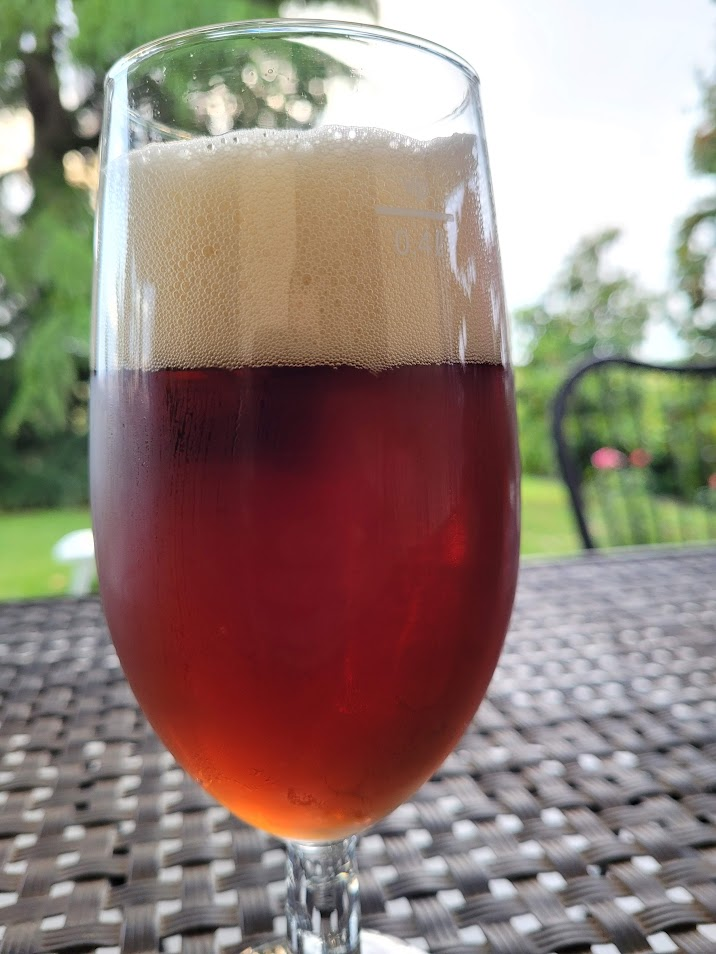

Roggenbier brassata il 07/01/2023

Ricetta come la [[brew.brews.2023.weiss]] ma con questo grist:

## Fermentabili

| Ingrediente      | Quantità (g) | Percentuale |
|------------------|--------------|-------------|
| Malto Monaco     | 1700         | 28%         |
| Malto Pils       | 2000         | 33%         |
| Malto Segale     | 2000         | 33%         |
| Malto Cara       | 250          | 4%          |
| Roasted Barley   | 50           | 1%          |

## Foto

