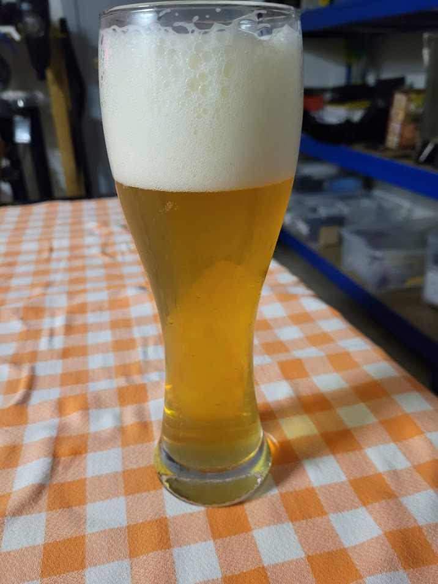

Weiss brassata il 21/01/2023

## Volume

| Volume della Cotta | Volume Pre-Bollitura |
| ------------------ | -------------------- |
| 22 L               | 26.46 L              |

## Efficienza

| Efficienza del birrificio | Efficienza di Ammostamento |
| ------------------------- | -------------------------- |
| 60%                       | 62.7%                      |

## Colore e Amaro

| EBC | IBU | BU/GU |
| --- | --- | ----- |
| 8.1 | 14  | 0.28  |
|     | 15  |       |

## Densità e Alcol

| OG    | FG    | ABV   |
| ----- | ----- | ----- |
| 1.052 | 1.014 | 5.63% |

## Fermentabili (6 kg)

| Ingrediente                 | Quantità | EBC |
| --------------------------- | -------- | --- |
| Pilsner, Organic Rhoen Malz | 3 kg     | 3.9 |
| Wheat Malt                  | 3 kg     | 3.9 |

## Luppoli (40 g)

| Luppolo | Quantità | %AA | IBU | Tempo Bollitura |
| ------- | -------- | --- | --- | --------------- |
| Perle   | 15 g     | 7.1 | 12  | 60 min          |
| Saphir  | 25 g     | 4.3 | 2.4 | 5 min           |
| Totale  | 40 g     |     | 14  |                 |

## BU/GU

0.28

## Gravità

| Gravità Pre-Bollitura | Gravità Iniziale | Gravità Finale Stimata |
| --------------------- | ---------------- | ---------------------- |
| 1.047                 | 1.052            | 1.014                  |

## Colore

8.1 EBC

## Lievito

1 pacch. Mangrove Jack's M20 72.5% Bavarian Wheat Yeast

## Profilo di Ammostamento (High fermentability)

| Temperatura | Tempo  |
| ----------- | ------ |
| 65 ℃        | 60 min |

## Profilo di Fermentazione (Ale)

| Fase     | Temperatura | Durata    |
| -------- | ----------- | --------- |
| Primaria | 20 ℃        | 14 giorni |

## Carbonazione

| Volumi di CO2 |
| ------------- |
| 2.4           |

## Acqua

| Tipo di Acqua          | Quantità |
| ---------------------- | -------- |
| Acqua di Ammostamento  | 30.2 L   |
| Acqua Totale           | 30.2 L   |
| Volume di Ammostamento | 34.22 L  |

## pH

6.05

## Foto

