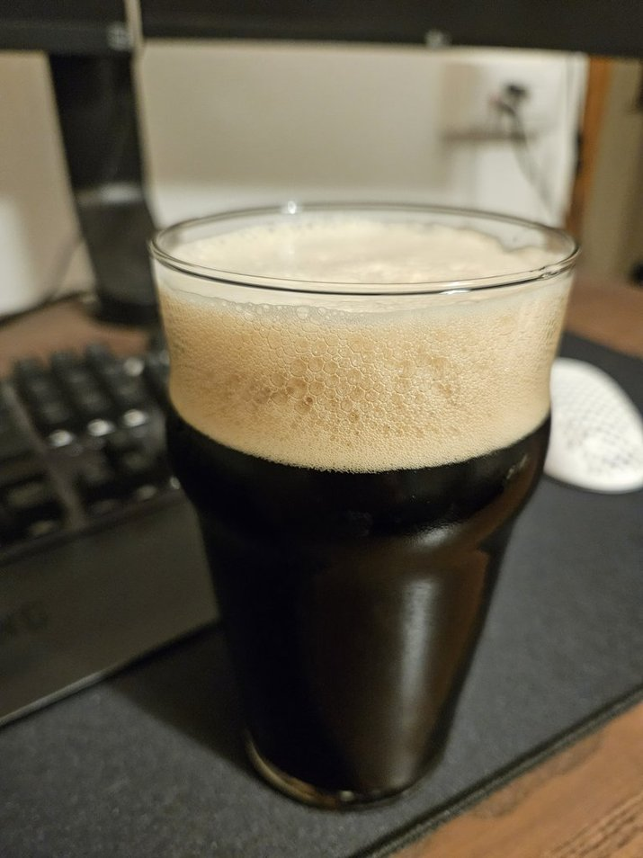

Oatmeal stout brassata il 22 maggio 2024

## Fermentabili

| Ingrediente     | Quantità (g) | Percentuale |
| --------------- | ------------ | ----------- |
| Malto Pale Ale  | 4600         | 7%          |
| Fiocchi d'avena | 1000         | 16%         |
| Roasted Barley  | 400          | 77%         |

## Luppolo

Uno a 60 per arrivare al giusto target per lo stile

## Lievito

S-04

## Impressioni

Buona stout con una bella setosità dovuta dall'avena, che non avevo mai provato.
Un bel sapore di nocciola aggiungerei.

