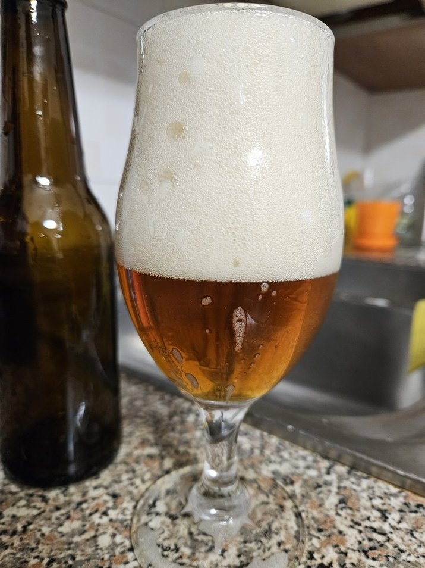

Saison con la segale brassata il 25 maggio 2024

## Volume

| Descrizione            | Valore  |
|------------------------|---------|
| lt mash                | 25 L    |
| Litri in pentola       | 21 L    |
| Litri in fermentatore  | 18 L    |

## Efficienza

| Descrizione            | Valore  |
|------------------------|---------|
| Efficienza             | 65%     |

## Bollitura

| Descrizione            | Valore  |
|------------------------|---------|
| Min bollitura          | 60 min  |

## Densità e Alcol

| Descrizione            | Valore  |
|------------------------|---------|
| OG preboil             | 1.046   |
| OG                     | 1.054   |
| ABV                    | 5.4%    |
| Plato                  | 13.4    |

## Colore e Amaro

| Descrizione            | Valore  |
|------------------------|---------|
| IBU                    | 34.3    |
| BU/GU                  | 0.64    |
| EBC                    | 12      |

## Malti e Fermentabili

| Ingrediente            | Tipo    | Quantità | Percentuale |
|------------------------|---------|----------|-------------|
| Pale                   | Grani   | 3000 gr  | 60%         |
| Malto di Segale        | Grani   | 1000 gr  | 20%         |
| Maris Otter            | Grani   | 1000 gr  | 20%         |
| **Totale**             |         | 5000 gr  |             |

## Luppoli

| Luppolo                | AA      | Quantità | Tempo       | Tipo   |
|------------------------|---------|----------|-------------|--------|
| Sabro                  | 15%     | 15 gr    | 60 min      | Pellet |
| Sabro                  | 15%     | 10 gr    | 5 min       | Pellet |
| Cascade                | 5.5%    | 20 gr    | 5 min       | Pellet |
| Sabro                  | 15%     | 15 gr    | Dry-Hop     | Pellet |
| Cascade                | 5.5%    | 20 gr    | Dry-Hop     | Pellet |
| **Totale**             |         | 80 gr    | 60 min      |        |

## Lieviti

Belle Saison Beer Yeast

## Considerazioni

Birra molto secca e dominata dalla forte speziatura della segale, un po' astringente.
Migliorabile.
Note di ossidazione probabilmente dovute al luppolo, che potrebbe giovare dall'uso della contropressione.
Schiuma notevole e qualche difficoltà a versarla, meglio andare più leggeri col priming in futuro.

