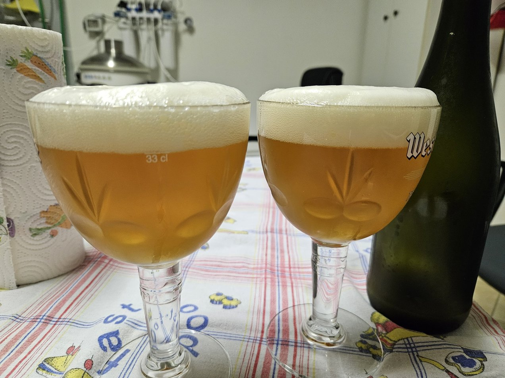

Saison brassata il 22/01/2024

## Volume

| Descrizione            | Valore  |
|------------------------|---------|
| lt mash                | 25 L    |
| Litri in pentola       | 21 L    |
| Litri in fermentatore  | 18 L    |

## Efficienza

| Descrizione            | Valore  |
|------------------------|---------|
| Efficienza             | 60%     |

## Bollitura

| Descrizione            | Valore  |
|------------------------|---------|
| Min bollitura          | 60 min  |

## Densità e Alcol

| Descrizione            | Valore  |
|------------------------|---------|
| OG preboil             | 1.042   |
| OG                     | 1.050   |
| ABV                    | 5.0%    |
| Plato                  | 12.4    |

## Colore e Amaro

| Descrizione            | Valore  |
|------------------------|---------|
| IBU                    | 29.1    |
| BU/GU                  | 0.58    |
| EBC                    | 11      |

## Malti e Fermentabili

| Ingrediente            | Tipo    | Quantità | Percentuale |
|------------------------|---------|----------|-------------|
| Maris Otter            | Grani   | 5000 gr  | 100%        |
| **Totale**             |         | 5000 gr  |             |

## Luppoli

| Luppolo                | AA      | Quantità | Tempo       | Tipo   |
|------------------------|---------|----------|-------------|--------|
| Nelson Sauvin          | 11.3%   | 20 gr    | 60 min      | Pellet |
| Nelson Sauvin          | 11.3%   | 40 gr    | 0 min       | Pellet |
| Nelson Sauvin          | 11.3%   | 40 gr    | Dry-Hop     | Pellet |
| **Totale**             |         | 100 gr   | 60 min      |        |

## Lieviti

Lallemand Belle Saison

## Considerazioni

Una buona saison secca e beverina, senza difetti di fermentazione. Il luppolo gioca nelle retrovie, senza impattare molto sull'aroma.

