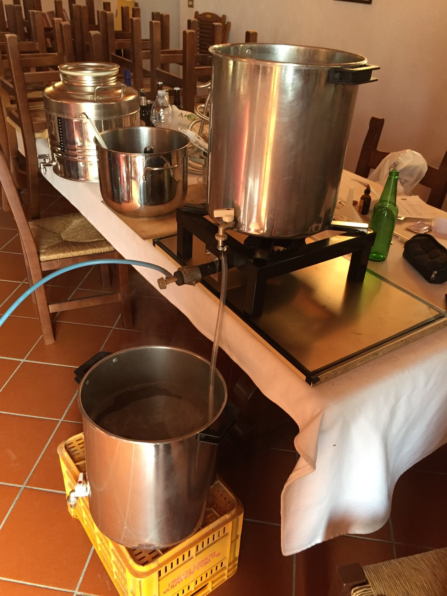

La prima versione venne utilizzata per la cotta del 02/04/2016 della [[doc.brew.brews.2016.ecstasy-of-gold]].

Consisteva in due pentole in acciaio inox da 35 litri forate con rubinetto e una pentola di dimensioni più piccole, sempre inox,  sui 12-13 litri da utilizzare per lo sparge.

Avevamo un solo fornellone da 8,5kw quindi richiedeva lo scambio delle due pentole grandi prima del boil.

L'acqua di sparge era scaldata parallelamente sul fornello di casa e poi versata lentamente su un mestolo forato e quindi sulla torta di trebbie tagliata a fette. Rimescolavamo per una quindicina di minuti facendo batch sparge.
Vista la grande differenza di dimensioni delle pentole utilizzavamo 3,5/4 litri d'acqua per chili di malto per il mash e 2 per lo sparge ottenendo efficienze di mash del 70% circa.

Il filtro springer era ricavato da un tubo flessibile in inox, con tubo interno in gomma tagliato e rimosso. Per un anno ci siamo ostinati con questo tipo di filtri autocostruiti e abbiamo sempre avuto grandi problemi di filtraggio.
Si piegano facilmente e tendono a muoversi quando si mescolano le trebbie rimanendo spesso impigliati nel mestolo, ma sopratutto si intasano sempre (e il frumento della weiss ovviamente non aiutava). Ragionando a posteriori dalle foto anche la macinatura era troppo fine.

L'attrezzatura accessoria era veramente basilare: termometro a gabbietta (che si è sempre confermato affidabile e pratico nell'utilizzo a dispetto del milione di termometri digitali che ci hanno abbandonato) e ph misurato con le cartine tornasole.
