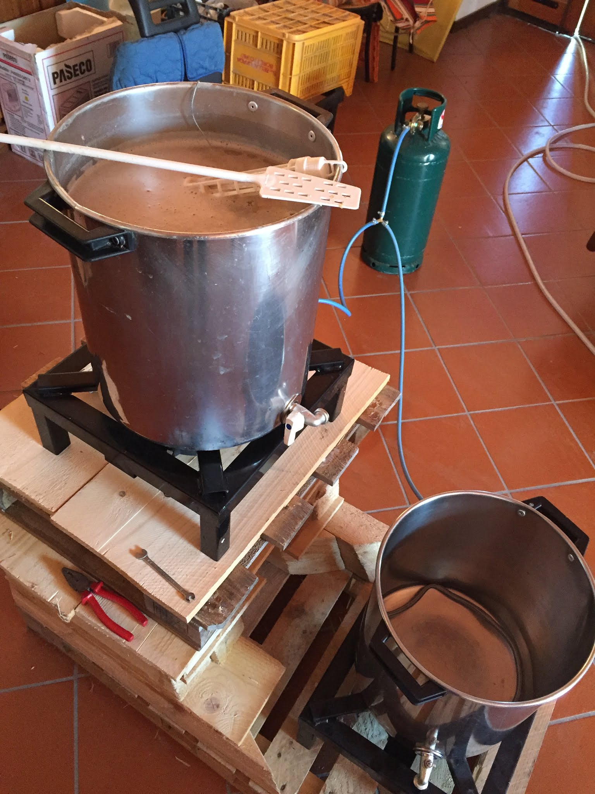

Nella seconda cotta abbiamo fatto alcune migliorie rispetto alla prima versione, nella quale mi sono reso conto del procedimento.
Abbiamo aggiunto:

- Un fornello uguale al primo per parallelizzare il mash con il riscaldamento dell'acqua di sparge (e relativi attacchi alla bombola).
- La struttura di legno per la cascata.
- Filtro springer alla pentola di boil, migliorato il filtro della pentola di mash.
- Migliorata la serpentina di raffreddamento (aumentata la lunghezza e collaudato gli attacchi alle canne).
- Termometro digitale.
- Calza per luppoli.
- Phmetro.
- Stereo Jbl bluetooth che sparava trap ignorante per ore (fondamentale).

