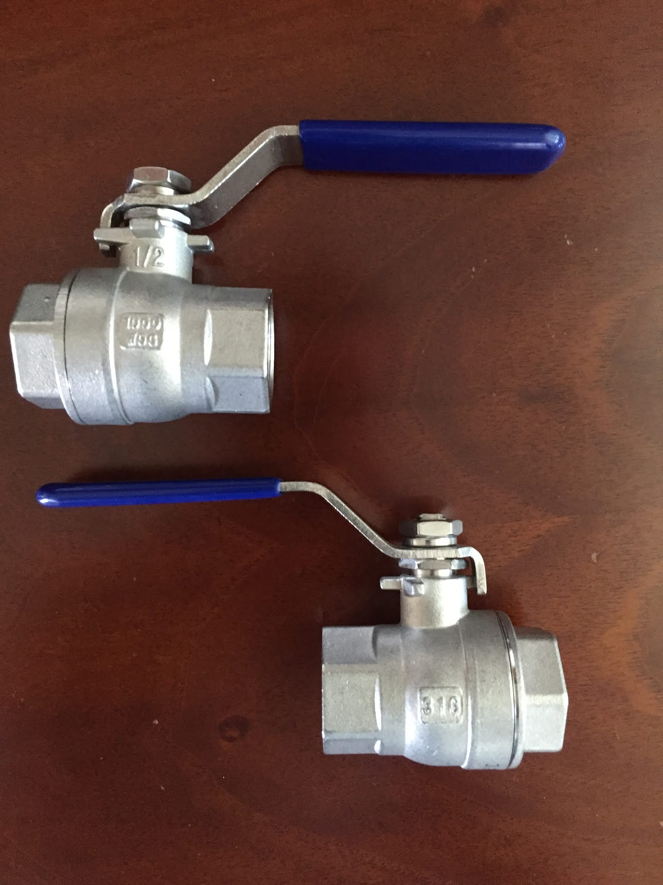
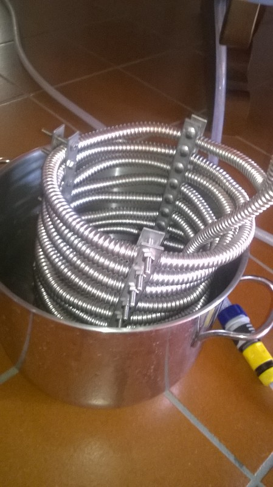

Avevamo intenzione di fare molte modifiche in estate, come motorizzare la fase di mash, fly sparge e automatizzare l'impianto, poi per mancanza di tempo ci siamo tenuti essenzialmente quello che avevamo con qualche miglioria.
Abbiamo cambiato solo i rubinetti con due valvole a sfera in inox le quali ci consentivano anche di poter avvitare i rubinetti leggermente storti ma ben stretti.

Non abbiamo ancora parlato della serpentina di raffreddamento, che cominciò con un tubo inox da 6 metri nella Mark 1 poi raddoppiata nella Mark 2 a 12, con un giunto saldato. Nella terza versione abbiamo applicato una struttura per tenere ferme le spire ed evitare la dilatazione che faceva fuoriuscire troppo l'ultima parte di serpentina dal mosto. Ci è costata probabilmente più la struttura (6 pezzi rettangolari e forati per le morse più tante viti e bulloni, tutto inox) che la serpentina stessa. E non è venuta nemmeno come volevo a livello estetico, inoltre richiede attenzione per non rigare la pentola con le viti e anche qualche difficoltà nel pulirla. Lezione imparata: diffidate dal fai da te estremo. Non paga sempre in termini di tempo, risultato ottenuto e costo.

