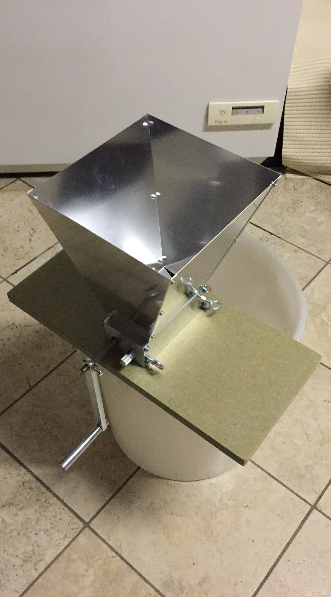
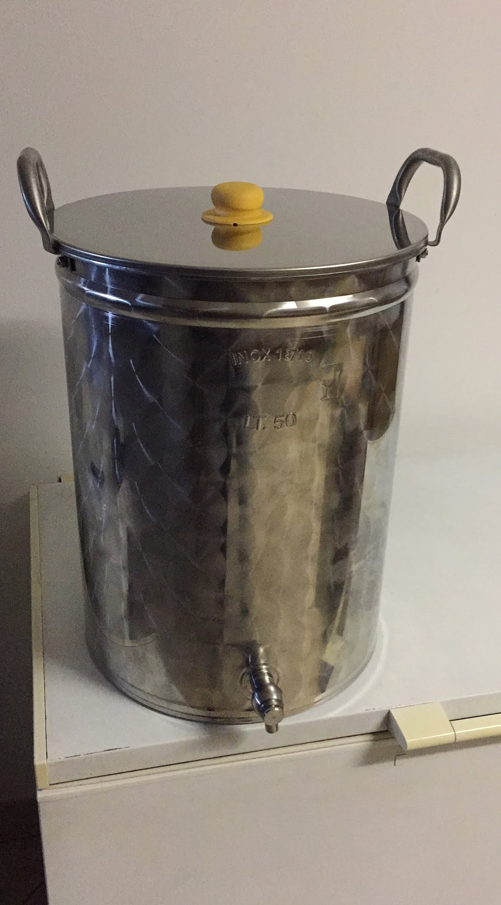
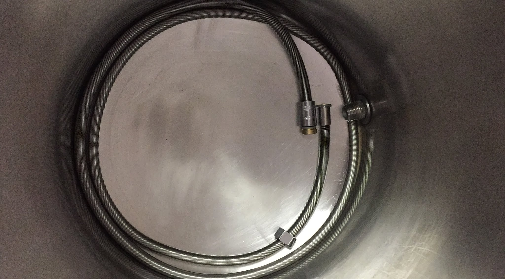

Continuo a parlare dell'evoluzione del nostro impianto a tre tini che venne aggiornato alla fine 2016 con una nuova pentola inox da 50 litri per la bollitura. L'impianto venne usato nei primi e negli ultimi mesi del 2017.

I due upgrade maggiori all'impianto, avvenuti a cavallo fra 2016 e 2017 sono stati l'acquisto di un mulino a rulli (prima tritavamo i malti in un mulino agricolo elettrico che sfarinava troppo, non so dirvi di più perché... non l'ho mai visto!) e una terza pentola per bilanciare l'acqua di sparge con quella di mash.

Ovviamente non poteva mancare l'ennesimo tentativo di costruire un filtro springer con un tubo flessibile...  
E abbiamo cambiato location spostandoci a casa mia.

