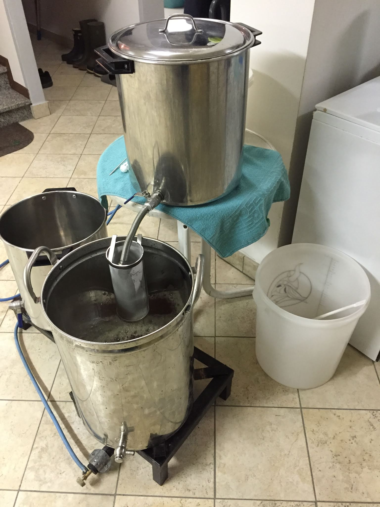

Dopo aver usato il biab d'estate siamo tornati al tre tini alla fine del 2017 per volumi maggiori.

Le new entry sono state:

- un filtro semplice a rete (bastavano 8 euro su amazon per porre fine alle nostre sofferenze in filtraggio).
- L'imbottigliatrice enolmatic per rendere più agevole la fase più noiosa di tutte.
- un filtro per i luppoli troppo piccolo per la pentola ma utilizzato per filtrare le farine e ridurre l'ossigenazione nel trasferimento del mosto alla pentola di bollitura.
- Un frigor gigante (recuperato da un socio) per controllare meglio la fermentazione.

