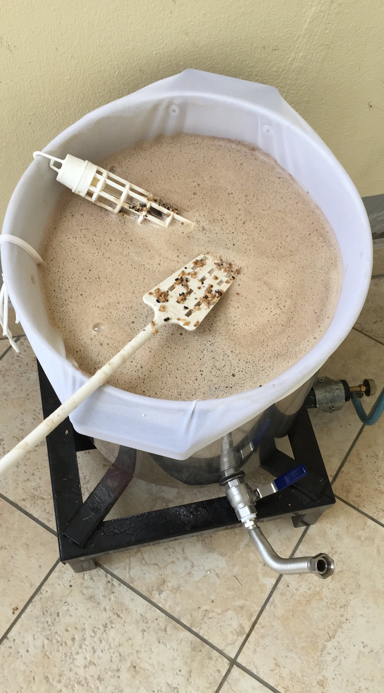
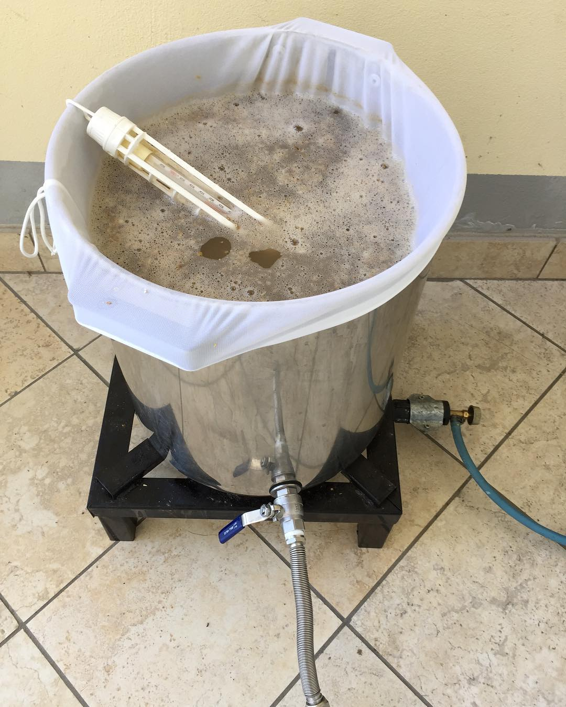

Con l'abbandono di un socio nel 2017 decidemmo di semplificare l'impianto per produrre qualche litro in meno. Nacque così un impianto costola del tre tini composto da una pentola da 35 litri con la sacca da biab e un fornellone.

## Debugging & refactoring

Se vediamo la scaletta (a parte la prima voce) appare chiara una cosa: la progressiva semplificazione e ottimizzazione dell'impianto.

> In ingegneria del software, il refactoring è una tecnica per modificare la struttura interna di porzioni di codice senza modificarne il comportamento esterno, applicata per migliorare alcune caratteristiche non funzionali del software. (Wikipedia)

Per anni il tre tini è stato il punto di riferimento per la produzione di birra in ambito casalingo (ma anche in ambito professionale per certi versi) e in genere si era prevenuti verso i metodi semplificati come il biab, visti come una sorta di scorciatoia.
Io stesso lo ero nel 2016 quando ho cominciato a guardarmi attorno per evolvere l'impianto. Seguendo il blog di BrewingBad sognavo di riprogettare l'impianto come il [loro tre tini/tre fornelli](https://brewingbad.com/2014/09/come-costruire-un-impianto-all-grain-a-tre-pentole/) e snobbavo il biab.

Nella primavera 2017, sconfortato da una serie negativa di cotte sfortunate ho fatto una profonda riflessione sul semplificare il più possibile il processo per capire dove sbagliavo. Lo stesso approccio del programmatore che deve risolvere un bug praticamente.

> Divide et impera.

Accantonato il sogno di costruirmi un herms elettrico come quello della demo di BrewPi sono passato al biab per attuare l'approccio di semplificazione.

La causa del problema di prima era: principi di infezioni dovute all'oxi-san che non disinfetta (colpa anche dei venditori di materiale brassicolo che contribuiscono a questa disinformazione) e ossidazioni eccessive dovute ai travasi. L'errore era quindi nella seconda parte della produzione, la parte "fredda", ma non lo avrei mai capito senza semplificare. E ho anche imparato che con qualche accorgimento si può produrre lo stesso mosto pulendo una sola pentola e riducendo di qualche ora il travaglio. Non male!

## L'impianto

Come accennato nell'introduzione ho cercato di semplificare all'osso le cotte che un tempo mi portavano via l'intero pomeriggio (dalle 14:00/15:00 alle 21:00/22:00 circa) al termine delle quali ero stravolto e facevo gli ultimi passaggi affrettatamente e in preda alla stanchezza. La parola d'ordine è BIAB, acronimo che sta per **brew in a bag** (birrificare nella sacca).

> Less is more!

Nell'estate del 2017 passare "al calzino" (per tre cotte) è stato semplice, è bastato tirare via due pentole, un fornellone, il raccordo a T per la bombola del gas e gli odiosi (non)filtri bazooka autocostruiti.
L'unica cosa che ho aggiunto è stata una comune sacca da BIAB. Ma la semplificazione non si è fermata qua.

Parallelamente al riscaldamento dell'acqua calcolavo la temperatura giusta in cui buttare i grani (formula di sgabuzen) mentre con il tre tini prevedevo una sosta di mash-in con una temperatura di qualche grado inferiore al primo step (retaggio dalle istruzioni dei kit all grain di birramia).

Con quest'ultimo metodo impazzivo coi fornelloni, la temperatura che scendeva improvvisamente e riaccendendo il fuoco risaliva anche a 70 gradi quindi raffreddavo con un po’ di acqua di sparge...  
In questo modo mi sono semplificato notevolmente la vita, una mescolata, chiudevo la pentola e tanti saluti (ho sempre perso al più un paio di gradi, complici le temperature estive).

Stando all'aperto in cortile mi sono preoccupato di meno di sporcare rispetto al garage e ho approfittato dell'acqua di raffreddamento oramai fredda per innaffiare gli alberi (i primi 30 litri caldi li riutilizzavo per pulire).

## Tempi

Non ho cronometrato il tempo ma riuscivo a finire per cena senza dover lavare dopo e anche meno stanco, il tempo risparmiato si può approssimare in un paio di ore in cui in precedenza.

- Facevo il mash out (15 minuti).
- Filtravo le trebbie (la maggior perdita di tempo era questa, a volte anche 1 ora).
- Batch sparge (15 minuti).
- Ri-filtravo le trebbie (30/60 minuti ma avveniva in parallelo al riscaldamento del mosto in bollitura).
- Minor tempo per portare il mosto in bollitura, complici:
  - La pentola più spessa (prima usavo quella da 50 litri più sottile e riempita 2/3).
  - Nessuna perdita di calore nel trasferimento alla pentola di bollitura.
  - Volumi leggermente minori (18 litri anziché 23 anche se non è dovuto al biab in se).
  - Minor tempo per la pulizia (1 sola pentola contro 2, quella di sparge non la conto).

## Altri vantaggi riscontrati

- Nessun problema di filtraggio nemmeno con alte dosi di frumento.
- Minor spazio occupato.
- Minor rischio di sporcare il pavimento (strettamente collegato al punto precedente).
- Minor fatica (e rischio) rispetto al 3 tini nel manovrare pentole calde ad altezza maggiore (per me che non avevo una struttura fissa a caduta o con pompa).
- Minor consumi ed efficienza energetica (abbastanza ininfluente ma c'è).
